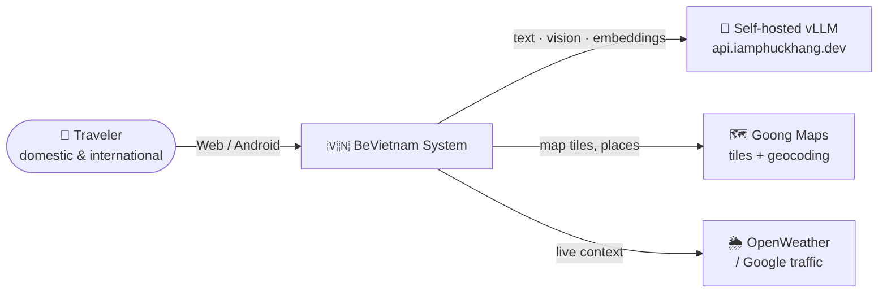
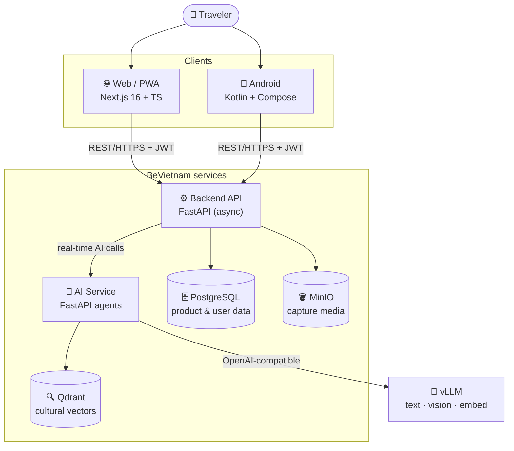
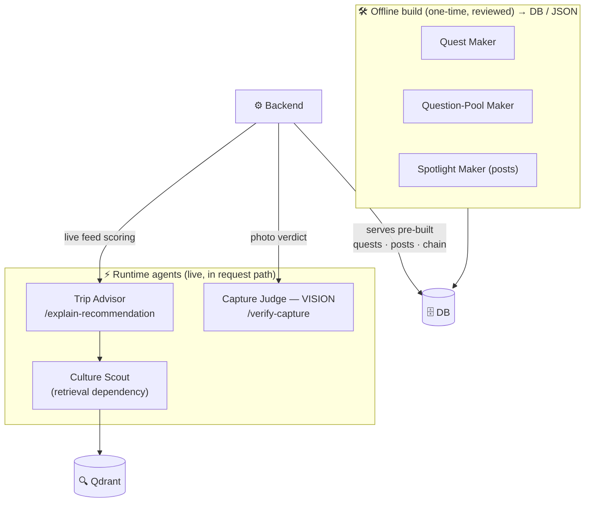
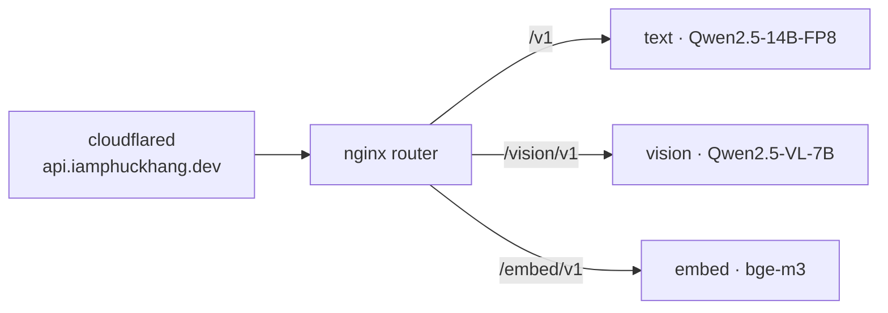

<div align="center">

# 🇻🇳 BeVietnam

### An Agent-Based Smart Tourism System for Vietnam

*Discover Vietnam with cultural depth — grounded, AI-powered, self-hosted.*

[](LICENSE)
[-009688?logo=fastapi)](services/backend/)
[](services/web/)
[-3DDC84?logo=android)](mobile/)
[](vllm_hosting/)

[Overview](#overview) · [Architecture](#architecture) · [AI Service](#ai-service-v2) · [Tech Stack](#tech-stack) · [Folder Structure](#folder-structure) · [Getting Started](#getting-started)

</div>

---

## Overview

**BeVietnam** helps travelers — domestic and international — engage with Vietnamese cultural
heritage. It is **not** a strict itinerary planner. The main loop:

> Share your location → see a **Facebook-style feed** of nearby cultural places, each explaining
> *why it's worth visiting right now* → the map renders places as **dynamic bubbles** (bigger =
> better current suitability) → optionally follow **storyline quests** (check-in / capture tasks)
> that unlock cultural context as you go.

Every cultural claim is **grounded in reviewed sources** (official/UNESCO/approved books), and all
recommendation scores are **computed in code** — the LLM phrases explanations, it does not invent
numbers.

**Current focus:** a **Huế pilot** (8-day window, small tourist survey). Active surfaces = backend,
AI service, web.

### Core features

| Feature | Description |
|---------|-------------|
| 🗺️ **Cultural feed + map bubbles** | Nearby places ranked by live suitability (weather, traffic, distance, crowd, cultural relevance) with a grounded "why now" |
| 🧭 **Storyline quests** | Geocaching-style cultural tasks (check-in, capture, observe), pre-built and reviewed |
| 📸 **Capture & verify** | A **vision agent** checks an uploaded photo against the task and returns a verdict |
| 🌐 **Bilingual** | Vietnamese / English across all surfaces |

---

## Architecture

The system is a **monorepo** of independently deployable services. Clients talk to the **Backend**;
the Backend owns product data and calls the **AI service** only for real-time decisions.

### System context



### Container architecture



**Data flow:** Web/Mobile → **Backend** (`/api/v1`, JWT) → **AI service** (internal HTTP). The
backend normalizes inputs, calls the AI, and adapts AI output into its own client shapes. The AI
service **never writes to PostgreSQL**.

---

## AI Service (v2)

The AI **runtime** serves only what must respond to **live user context**. Everything that can be
decided ahead of time is **pre-built offline**, reviewed once, and served by the backend from the
database — no LLM in the request path. (Full design: [`docs/AI_AGENT_ARCHITECTURE_V2.md`](docs/AI_AGENT_ARCHITECTURE_V2.md).)



| Agent | Role | When |
|-------|------|------|
| **Trip Advisor** | Scores a place + grounded "why visit now" (numbers in Python, LLM phrases) | ⚡ Runtime |
| **Capture Judge** | Vision agent — image vs task → match verdict | ⚡ Runtime *(WIP)* |
| **Culture Scout** | Source-backed retrieval from Qdrant | ⚡ Runtime (dep of Trip Advisor) |
| **Safety Keeper** | Validates AI output (grounded, sized, safe) | Build-time + guard |
| **Publisher** | Wraps output in `{status, data, metadata}` | Utility |
| **Quest / Question-Pool / Spotlight Maker** | Generate quests, question pool, feed posts | 🛠️ Offline |

### Model serving — vLLM only

All text / vision / embedding runs on **self-hosted vLLM** at `api.iamphuckhang.dev` (Gemini
retired). Three backends sit behind one nginx path-router, fitting **one L40 (48 GB)** for the pilot:



Serving stack + GPU layout: [`vllm_hosting/README.md`](vllm_hosting/README.md).

**Design principles:** backend owns product data · structured Pydantic outputs only · retrieval
before generation (claims grounded in `source_refs`) · every workflow has a fallback · scores are
deterministic and code-computed.

---

## Tech Stack

| Layer | Technology | Purpose |
|-------|-----------|---------|
| **Web** | Next.js 16 + TypeScript, CSS Modules | Web app / PWA, custom i18n (vi/en) |
| **Mobile** | Kotlin + Jetpack Compose, Retrofit, Hilt, CameraX | Native Android |
| **Backend** | FastAPI (async), SQLAlchemy + asyncpg, Alembic | REST API, product/user data |
| | JWT (python-jose, bcrypt), MinIO (boto3) | Auth + capture storage |
| **AI service** | FastAPI, Qdrant, bge-m3 embeddings | Real-time agents + retrieval |
| **Models** | Self-hosted **vLLM** — Qwen2.5-14B (text), Qwen2.5-VL-7B (vision), bge-m3 (embed) | Generation / vision / embeddings |
| **Infra** | Docker Compose, GitHub Actions, Azure (web), Cloudflare tunnel (AI) | Local + production |

---

## Folder Structure

```
.
├── services/
│   ├── ai/                     # AI service — FastAPI agents + retrieval
│   │   ├── agents/             #   trip_advisor, capture_judge, culture_scout,
│   │   │                       #   safety_keeper, publisher, quest_maker,
│   │   │                       #   question_pool_maker, spotlight_maker
│   │   ├── api/                #   HTTP routes the backend calls
│   │   ├── common/             #   config, llm gateway (vLLM), schemas, qdrant_store
│   │   └── main.py
│   ├── backend/                # FastAPI backend (async)
│   │   └── app/
│   │       ├── api/endpoints/  #   HTTP route handlers (auth, feed, places, uploads…)
│   │       ├── services/       #   business logic
│   │       ├── repositories/   #   async DB access
│   │       ├── models/         #   SQLAlchemy ORM
│   │       └── schemas/        #   Pydantic request/response
│   └── web/                    # Next.js web app
│       └── src/
│           ├── app/            #   route wrappers (thin)
│           ├── features/       #   feature modules (auth, explore, storyline…)
│           ├── components/     #   shared UI
│           └── styles/         #   design tokens + globals (lacquer theme)
├── mobile/                     # Native Android (Kotlin + Compose)
├── vllm_hosting/               # Self-hosted vLLM stack (3 backends + nginx + tunnel)
├── data/                       # Knowledge base, sources, question_pool.json, posts, books
├── scripts/data-pipeline/      # Offline builders (knowledge, quests, posts)
├── database/                   # DB init / migrations
├── docs/                       # Architecture & design docs (AI_AGENT_ARCHITECTURE_V2.md …)
├── docker-compose.yaml         # Local multi-service setup
├── CONTRIBUTING.md             # Team standards & workflow
└── CLAUDE.md                   # Engineering guidelines
```

---

## Getting Started

### Prerequisites
- Docker & Docker Compose
- Node.js ≥ 20 (web), Python ≥ 3.11 (backend / AI)
- A reachable vLLM endpoint (see [`vllm_hosting/`](vllm_hosting/)) or set the AI service to mock

### Quick start (Docker)

```bash
cp .env.example .env          # configure
docker compose up
```

| Service | URL |
|---------|-----|
| Backend API | http://localhost:8000 · Swagger `/docs` |
| Web app | http://localhost:3000 |
| AI service | http://localhost:8001 |

### Local development

<details>
<summary><strong>Backend</strong></summary>

```bash
# from repo root (absolute `services.backend.*` imports need root on PYTHONPATH)
python -m venv services/backend/venv && source services/backend/venv/bin/activate
pip install -r services/backend/requirements.txt
cp services/backend/.env.example services/backend/.env   # DATABASE_URL, SECRET_KEY, MINIO_*, AI_CORE_BASE_URL
PYTHONPATH=. uvicorn services.backend.app.main:app --reload --port 8000
```
</details>

<details>
<summary><strong>Web</strong></summary>

```bash
cd services/web
npm install
npm run dev                   # http://localhost:3000
```
</details>

<details>
<summary><strong>AI service</strong></summary>

```bash
# from repo root
PYTHONPATH=. python -m uvicorn services.ai.main:app --port 8001
# config: services/ai/common/config.py — vllm_base_url, qdrant, llm_provider (vllm|mock)
```
</details>

---

## API Reference

Backend base URL: `http://localhost:8000/api/v1` (interactive docs at `/docs`).

| Method | Endpoint | Description |
|--------|----------|-------------|
| `POST` | `/auth/register` · `/auth/login` · `GET /auth/me` | JWT auth |
| `GET` | `/places` · `/feed` | Places + personalized feed |
| `GET` | `/storyline/quest` · `/storyline/next-task` | Quest chain / next task |
| `POST` | `/storyline/verify-capture` · `/uploads/capture` | Capture verify + media upload |

**AI service** (internal): `POST /explain-recommendation`, `POST /verify-capture`,
`POST /generate-task`, `POST /generate-question-pool`, `GET /quest-chain`.

---

## Contributing

Read **[CONTRIBUTING.md](./CONTRIBUTING.md)** (branch/commit conventions, per-platform code style,
layer rules, PR checklist) and **[CLAUDE.md](./CLAUDE.md)** (engineering guidelines).

---

## License

MIT — see [LICENSE](LICENSE).

<div align="center">
  <sub>Built with ❤️ for Vietnam's cultural heritage · HCMUS 2026</sub>
</div>
</content>
