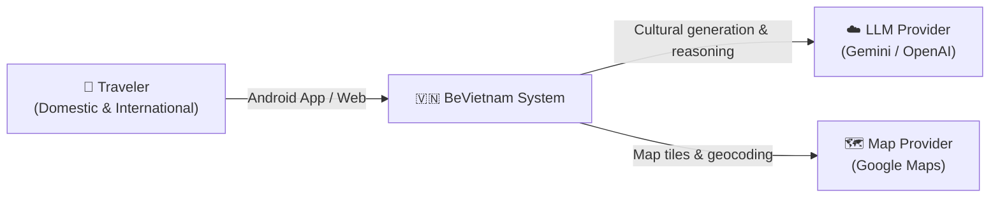
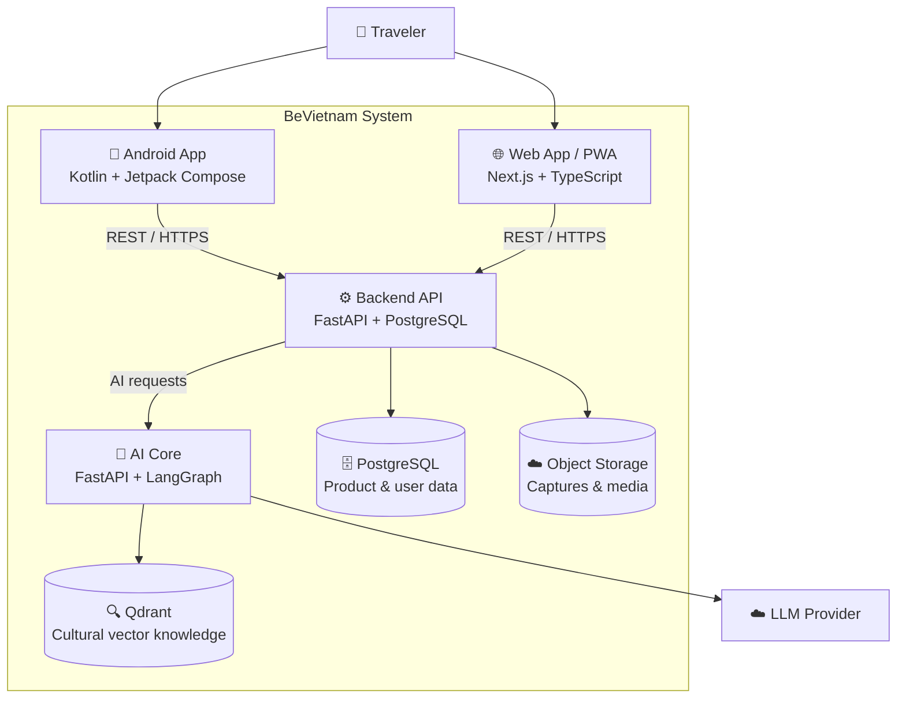
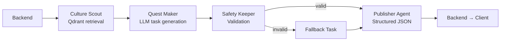

<div align="center">

# 🇻🇳 BeVietnam

### An Agent-Based Smart Tourism System for Vietnam

*Discover Vietnam with cultural depth — powered by AI*

[](LICENSE)
[](backend/)
[](web/)
[-3DDC84?logo=android)](mobile/)
[](ai-core/)

[Overview](#overview) · [Architecture](#architecture) · [Tech Stack](#tech-stack) · [Getting Started](#getting-started) · [API Reference](#api-reference) · [Contributing](#contributing)

</div>

---

## Overview

**BeVietnam** is a multi-platform smart tourism system that helps travelers — both domestic and international — discover Vietnam's cultural heritage through AI-powered, personalized experiences.

### Core Features

| Feature | Description |
|---------|-------------|
| 🗺️ **Storyline Quests** | Duolingo-style cultural exploration tasks that guide travelers through meaningful experiences |
| 🤖 **AI Personalization** | Intelligent feed recommendations with cultural context and explanation |
| 📸 **Capture & Verify** | Photo check-ins verified by AI to confirm task completion |
| 📖 **Travel Memories** | Auto-generated travel vlogs from a user's daily captures |
| 🌐 **Bilingual** | Full Vietnamese and English support across all platforms |

### Platforms

- **Android App** — Native Kotlin + Jetpack Compose
- **Web App / PWA** — Next.js 15 + TypeScript
- **Backend API** — FastAPI (Python)
- **AI Core** — LangGraph agent workflows + Gemini

---

## Architecture

### System Context



### Container Architecture



### AI Agent Pipeline

The AI Core is a **separate service** from the Backend. Each AI feature runs as an explicit LangGraph workflow with defined inputs, outputs, validation, and fallback behavior.

| Agent | Role | Realtime? |
|-------|------|-----------|
| **Culture Scout** | Retrieves cultural facts from Qdrant | ✅ Yes (vector search) |
| **Quest Maker** | Generates storyline tasks via LLM | ✅ Yes |
| **Trip Advisor** | Explains feed recommendations | ✅ Yes (can be templated) |
| **Capture Judge** | Verifies photo task completion | ⚡ Async for vision |
| **Memory Curator** | Selects captures for vlog generation | 🔁 Background job |
| **Story Weaver** | Writes travel memory narrative | 🔁 Background job |
| **Safety Keeper** | Validates all AI outputs | ✅ Yes (lightweight) |
| **Publisher Agent** | Packages AI output for Backend | ✅ Final step |

**Workflow — Cultural Task Generation:**


**AI Core Design Principles:**
1. **Backend owns product data** — AI Core never writes directly to PostgreSQL
2. **Structured outputs only** — all AI responses are validated Pydantic schemas
3. **Retrieval before generation** — cultural claims must be grounded in Qdrant context
4. **Fail safe** — every workflow has a defined fallback response
5. **Mock first** — ship vertical slices with mocks, replace with real AI incrementally

---

## Tech Stack

| Layer | Technology | Purpose |
|-------|-----------|---------|
| **Mobile** | Kotlin + Jetpack Compose | Native Android UI |
| | Retrofit + OkHttp | API communication |
| | Hilt | Dependency injection |
| | CameraX | Photo capture for check-ins |
| | Google Maps SDK | Map-based place discovery |
| **Web** | Next.js 15 + TypeScript | Responsive web app & PWA |
| | CSS Modules | Component-scoped styling |
| | i18n (custom) | Vietnamese / English |
| **Backend** | FastAPI + Python | REST API service |
| | PostgreSQL + SQLAlchemy | Relational data storage |
| | Alembic | Database migrations |
| | JWT | Authentication |
| **AI Core** | FastAPI + LangGraph | Agent workflow orchestration |
| | LangChain | LLM & tool integration |
| | Qdrant | Cultural vector knowledge base |
| | Gemini / OpenAI | Language & vision models |
| **Infrastructure** | Docker + Docker Compose | Local & production containerization |
| | GitHub Actions | CI/CD |

---

## Getting Started

### Prerequisites

- Docker & Docker Compose
- Node.js ≥ 20 (for web)
- Python ≥ 3.11 (for backend / AI Core)
- Android Studio Hedgehog+ (for mobile)

### Quick Start (Docker)

```bash
# Clone the repository
git clone https://github.com/your-org/An-Agent-Based-Smart-Tourism-System-for-Vietnam.git
cd An-Agent-Based-Smart-Tourism-System-for-Vietnam

# Copy environment config
cp .env.example .env

# Start all services
docker compose up
```

| Service | URL |
|---------|-----|
| Backend API | http://localhost:8000 |
| Backend Swagger | http://localhost:8000/docs |
| Web App | http://localhost:3000 |
| AI Core | http://localhost:8001 |

### Local Development

<details>
<summary><strong>Backend</strong></summary>

```bash
cd backend
python -m venv .venv
source .venv/bin/activate  # Windows: .venv\Scripts\activate
pip install -r requirements.txt

# Copy and configure environment
cp .env.example .env

# Run with hot reload
uvicorn app.main:app --reload --port 8000
```
</details>

<details>
<summary><strong>Web</strong></summary>

```bash
cd web
npm install
npm run dev
# App runs at http://localhost:3000
```
</details>

<details>
<summary><strong>Mobile</strong></summary>

1. Open `mobile/` in Android Studio
2. Sync Gradle dependencies
3. Update `BASE_URL` in `core/util/Constants.kt` to point to your Backend
4. Run on emulator or physical device (API level 26+)
</details>

---

## API Reference

Base URL: `http://localhost:8000/api/v1`

### Backend Endpoints

| Method | Endpoint | Description |
|--------|----------|-------------|
| `GET` | `/health` | Service health check |
| `GET` | `/places` | List places (supports `?category=`, `?limit=`, `?offset=`) |
| `GET` | `/feed` | Personalized place recommendations |
| `GET` | `/storyline/quest` | Full quest chain for storyline UI |
| `GET` | `/storyline/next-task` | Generate next AI cultural task |
| `POST` | `/storyline/verify-capture` | Verify task completion via photo |
| `POST` | `/captures` | Submit photo capture metadata |

> Full interactive docs: **http://localhost:8000/docs**

### AI Core Endpoints

| Method | Endpoint | Description |
|--------|----------|-------------|
| `GET` | `/health` | AI Core availability |
| `POST` | `/generate-task` | Generate cultural storyline task |
| `POST` | `/explain-recommendation` | Explain feed recommendation |
| `POST` | `/verify-capture` | Vision-based task verification |
| `POST` | `/generate-vlog` | Generate travel memory draft |

---

## Project Structure

```
.
├── backend/                 # FastAPI backend service
│   └── app/
│       ├── api/endpoints/   # HTTP route handlers
│       ├── services/        # Business logic
│       ├── repositories/    # Database access layer
│       ├── models/          # SQLAlchemy ORM models
│       └── schemas/         # Pydantic request/response schemas
├── web/                     # Next.js web application
│   └── src/
│       ├── app/             # Route wrappers (thin layer)
│       ├── features/        # Feature modules (auth, explore, storyline...)
│       ├── components/      # Shared UI components
│       └── styles/          # Global CSS
├── mobile/                  # Native Android application
│   └── app/src/main/java/com/bevietnam/
│       ├── core/            # Domain, data, DI layers
│       └── ui/              # Screens, components, navigation, theme
├── ai-core/                 # LangGraph AI agent service
├── docs/                    # Architecture & design documents
├── CONTRIBUTING.md          # Team code standards & workflow
└── docker-compose.yml       # Local multi-service setup
```

---

## Contributing

Please read **[CONTRIBUTING.md](./CONTRIBUTING.md)** before submitting any pull request. It covers:

- Git branch naming and commit message conventions
- Code style rules per platform (Python, TypeScript, Kotlin)
- Layer architecture rules (what belongs where)
- Testing requirements
- PR review checklist

### Team

| Role | Responsibility |
|------|---------------|
| **Backend** | FastAPI API, PostgreSQL schema, Auth, REST contracts |
| **AI Core** | LangGraph agents, Qdrant indexing, LLM integration |
| **Android** | Kotlin app, Jetpack Compose UI, Hilt DI |
| **Web** | Next.js frontend, PWA, i18n, feature modules |

---

## License

This project is licensed under the **MIT License** — see [LICENSE](LICENSE) for details.

---

<div align="center">
  <sub>Built with ❤️ for Vietnam's cultural heritage · HCMUS 2026</sub>
</div>
