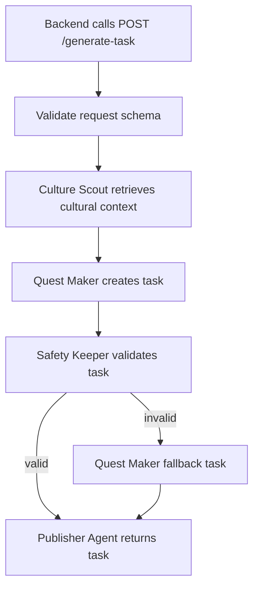
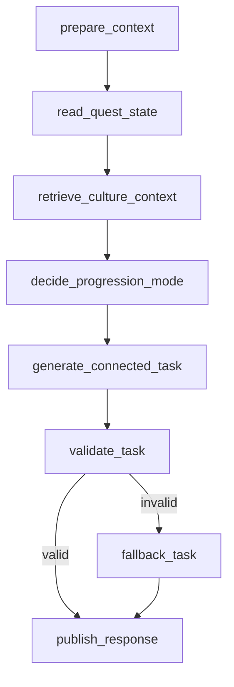

# Quest Maker Agent

## Overview

Quest Maker should be designed from the business problem first, not from the model or framework first.

The core question is:

```text
How can the system help a traveler know what meaningful cultural action to do next?
```

Quest Maker answers that question by transforming user context, nearby place data, current quest progress, and retrieved cultural knowledge into one clear exploration task.

The task model should feel similar to **geocaching**: the user receives a current task, completes it by visiting/capturing/observing something, then unlocks the next connected task. Tasks should not feel like isolated one-off suggestions. They should form a small storyline or route where each task gives context for the next one.

In real business development, this agent should be treated as a product feature with measurable input, output, quality rules, and fallback behavior. The implementation should follow computational thinking:

| Computational Thinking Step | How It Applies To Quest Maker |
|---|---|
| **Decomposition** | Break task generation into smaller parts: collect context, retrieve culture, choose focus, generate task, validate, return response. |
| **Pattern Recognition** | Identify common task types such as photo task, observation task, food discovery task, indoor rainy-day task, history task, and architecture task. |
| **Abstraction** | Represent all generated tasks with the same JSON shape so Android, web, and backend do not care how the task was produced. |
| **Algorithm Design** | Define a repeatable workflow: input context → cultural retrieval → prompt generation → validation → fallback → structured output. |
| **Evaluation** | Check whether the generated task is useful, safe, culturally grounded, short enough for UI, and possible for a traveler to complete. |

### Use Case

**Use case name:** Generate the next connected geocaching-style cultural exploration task.

**User problem:**

A traveler is in Vietnam but may not know what to explore nearby, what cultural details are meaningful, or how to interact with a place beyond reading generic information.

**Business goal:**

Increase user engagement and cultural learning by giving the traveler a sequence of small, achievable, culturally meaningful tasks that feel like a guided treasure hunt through real places.

**AI goal:**

Generate the current or next task in a connected quest chain. The task should be:

- relevant to the user's current context;
- connected to previous and next task progress;
- grounded in cultural knowledge;
- safe and respectful;
- simple enough to understand quickly;
- structured so backend and frontend can use it reliably.

**Trigger:**

The backend calls AI Core when the user needs the next storyline task:

```text
Backend API → POST /generate-task → Quest Maker workflow
```

**Main user story:**

```text
As a traveler,
I want to complete a connected sequence of cultural tasks near my current context,
so that exploring Vietnam feels like a guided treasure hunt instead of isolated recommendations.
```

**Example scenario:**

```text
A traveler is near Ben Thanh Market and likes food/history.
The current task asks the traveler to find a local trading detail.
After the traveler completes it, the next task should connect to the same cultural storyline, such as finding a traditional food stall or observing how locals bargain.
Culture Scout retrieves facts about local market culture.
Quest Maker creates the next task in the chain.
Safety Keeper validates that the task is safe and realistic.
Publisher Agent returns the task JSON to backend.
Android displays the task to the traveler.
```

**What should be coded first:**

1. Define the request and response schema.
2. Keep the mock fallback task working.
3. Add Culture Scout context into the workflow.
4. Add the real prompt for task generation.
5. Validate the output with Safety Keeper.
6. Add test cases for common scenarios.

**What should not be coded first:**

- complex autonomous planning;
- multi-step conversations;
- direct database writes from AI Core;
- advanced personalization before the basic task flow works;
- multiple LLM calls for one simple task.

## 1. Purpose

`Quest Maker` is the AI agent responsible for creating cultural exploration tasks for travelers.

In the BeVietnam system, a task is not just a normal recommendation. It should encourage the traveler to actively explore, observe, capture, or learn something meaningful about Vietnamese culture.

Example task:

```json
{
  "title": "Find a local cultural detail",
  "description": "Capture one photo of a place detail that represents local culture.",
  "cultural_explanation": "Small architectural and visual details often reveal local identity.",
  "completion_requirement": "Upload one photo with location metadata.",
  "difficulty": "easy",
  "reason_codes": ["culture", "beginner_friendly"]
}
```

The agent is used by the AI Core endpoint:

```text
POST /generate-task
```

The backend calls this endpoint when it needs the next storyline task for a user.

---

## 2. Responsibility

Quest Maker is responsible for:

1. Reading user context.
2. Reading cultural context retrieved by `Culture Scout`.
3. Creating an exploration task.
4. Returning structured task JSON.
5. Falling back to a safe default task if generation fails.

Quest Maker is **not** responsible for:

- storing tasks in PostgreSQL;
- directly calling the Android or web app;
- deciding long-term user progress;
- ranking all places in the feed;
- verifying uploaded captures.

Those responsibilities belong to backend services or other agents.

---

## 3. Position In AI Workflow

Quest Maker usually runs inside this workflow:

```text
Backend API
  ↓
AI Core POST /generate-task
  ↓
Validate request schema
  ↓
Culture Scout retrieves cultural context
  ↓
Quest Maker generates task
  ↓
Safety Keeper validates task format/safety
  ↓
Publisher Agent returns structured response
  ↓
Backend returns task to Android/Web
```

Mermaid view:



---

## 4. Input

Quest Maker receives a Python dictionary from the workflow layer.

Expected context shape:

```python
{
    "user_id": "user-123",
    "latitude": 10.762622,
    "longitude": 106.660172,
    "interests": ["history", "street_food", "architecture"],
    "quest_state": {
        "quest_id": "quest-ben-thanh-market",
        "current_step_index": 2,
        "completed_tasks": [
            {
                "task_id": "task-1",
                "title": "Find the old market gate",
                "completion_summary": "User captured the entrance gate"
            }
        ],
        "current_task": {
            "task_id": "task-2",
            "title": "Capture a trading detail",
            "status": "completed"
        }
    },
    "nearby_places": [
        {
            "place_id": "place-1",
            "name": "Ben Thanh Market",
            "category": "market",
            "description": "Historic market in Ho Chi Minh City"
        }
    ],
    "cultural_context": [
        {
            "fact": "Ben Thanh Market is one of the symbolic commercial landmarks of Ho Chi Minh City.",
            "source": "cultural_knowledge_base",
            "confidence": 0.86
        }
    ],
    "weather": {
        "condition": "rainy",
        "temperature_c": 28
    },
    "language": "en"
}
```

### Required input fields for MVP

| Field | Required? | Description |
|---|---:|---|
| `user_id` | Yes | User requesting the task. |
| `latitude` | Optional | User latitude. Can be missing in early mocks. |
| `longitude` | Optional | User longitude. Can be missing in early mocks. |
| `interests` | Optional | User interest codes. |
| `quest_state` | Recommended | Current quest chain state, including completed tasks and current task status. |
| `nearby_places` | Optional | Candidate places from backend. |
| `cultural_context` | Optional but recommended | Retrieved knowledge from Culture Scout. |
| `weather` | Optional | Weather context for better task relevance. |
| `language` | Optional | Preferred output language. |

---

## 5. Output

Quest Maker must return structured JSON.

Expected output shape:

```python
{
    "quest_id": str,
    "task_id": str,
    "step_index": int,
    "title": str,
    "description": str,
    "cultural_explanation": str,
    "completion_requirement": str,
    "unlock_condition": dict,
    "next_task_hint": str,
    "difficulty": "easy" | "medium" | "hard",
    "reason_codes": list[str]
}
```

### Output field meaning

| Field | Description |
|---|---|
| `quest_id` | ID of the connected quest chain. |
| `task_id` | ID of this generated task. |
| `step_index` | Position of this task in the chain. |
| `title` | Short task title shown in UI. |
| `description` | User-facing task instruction. |
| `cultural_explanation` | Why the task matters culturally. |
| `completion_requirement` | What user must do to complete the task. |
| `unlock_condition` | Condition that must be satisfied before next task unlocks. |
| `next_task_hint` | Small clue that motivates the next connected task without fully revealing it. |
| `difficulty` | Task difficulty. MVP should mostly use `easy`. |
| `reason_codes` | Machine-readable explanation tags. |

### Example output

```json
{
  "quest_id": "quest-ben-thanh-market",
  "task_id": "task-3",
  "step_index": 3,
  "title": "Find the flavor clue",
  "description": "Walk from the market entrance toward the food area and capture one photo of a stall or sign that shows local eating culture.",
  "cultural_explanation": "Markets are important social and commercial spaces in Vietnamese cities, where food, language, architecture, and daily life meet.",
  "completion_requirement": "Upload one photo showing a food stall, local product, or market sign with location metadata.",
  "unlock_condition": {
    "type": "capture_required",
    "requires_location": true,
    "requires_photo": true
  },
  "next_task_hint": "Your next clue may be hidden in how people gather, order, and share food nearby.",
  "difficulty": "easy",
  "reason_codes": ["culture", "market", "local_life", "photo_task", "quest_chain"]
}
```

---

## 6. Geocaching-Style Quest Chain Logic

Quest Maker should generate tasks as part of a connected chain.

The backend should store and own the durable quest state, while Quest Maker decides what the next meaningful task should be based on that state.

### Key concepts

| Concept | Meaning |
|---|---|
| `quest_id` | A connected storyline or route, such as `quest-ben-thanh-market`. |
| `task_id` | A single task inside the quest. |
| `current_task` | The task the user is currently doing or just completed. |
| `next_task` | The task generated after the current task is completed. |
| `unlock_condition` | The completion rule that allows the next task to unlock. |
| `next_task_hint` | A clue that creates curiosity and continuity. |
| `completed_tasks` | Previous tasks used to avoid repetition and maintain story flow. |

### Example chain

```text
Task 1: Find the old market gate
  ↓ completed by photo capture
Task 2: Capture a trading detail
  ↓ completed by photo capture near market stalls
Task 3: Find the flavor clue
  ↓ completed by food stall or product capture
Task 4: Discover a social detail
```

The important rule is:

```text
The next task should feel like it naturally follows from the current task.
```

It should not randomly jump from:

```text
market entrance → mountain temple → beach activity
```

unless the quest design intentionally changes location.

## 7. Core Logic

The MVP logic should follow this sequence:

### Step 1: Read available context and quest state

Quest Maker checks what the workflow provides:

- Does the user have interests?
- Are there nearby places?
- Did Culture Scout return useful cultural facts?
- Is there weather or time context?
- What task did the user just complete?
- What tasks already exist in this quest chain?
- What should not be repeated?

### Step 2: Determine progression mode

The agent decides whether to:

- continue the same place storyline;
- move to a nearby clue;
- deepen the same cultural theme;
- change task type, such as observation → capture → reflection;
- end the quest chain if the route is complete.

### Step 3: Select task focus

The agent chooses one task focus:

- a nearby place;
- a cultural theme;
- a visual detail;
- a food/local-life observation;
- an indoor/outdoor activity based on context;
- a clue connected to the previous task.

### Step 4: Generate task

In the real implementation, Quest Maker will call an LLM with a structured prompt.

The prompt should tell the model to:

- create one task only;
- keep it short and doable;
- ground cultural claims in provided context;
- avoid unsafe or impossible tasks;
- return JSON only.

### Step 5: Validate with Safety Keeper

Safety Keeper checks:

- required fields exist;
- text is not empty;
- task is safe;
- task is realistic;
- output follows expected schema.

### Step 6: Fallback if invalid

If generation fails, return a safe generic task:

```json
{
  "quest_id": "fallback-cultural-quest",
  "task_id": "fallback-task-1",
  "step_index": 1,
  "title": "Find a local cultural detail",
  "description": "Capture one photo of a place detail that represents local culture.",
  "cultural_explanation": "Small visual details often reveal local identity.",
  "completion_requirement": "Upload one photo with location metadata.",
  "unlock_condition": {
    "type": "capture_required",
    "requires_location": true,
    "requires_photo": true
  },
  "next_task_hint": "Look for another nearby detail that shows how people live, trade, or gather here.",
  "difficulty": "easy",
  "reason_codes": ["culture", "beginner_friendly", "fallback"]
}
```

---

## 7. Current Implementation Status

Current file:

```text
ai/quest_maker/agent.py
```

Current implementation is only a draft/mock:

```python
class QuestMaker:
    def generate(self, context: dict) -> dict:
        return {
            "title": "Find a local cultural detail",
            ...
        }
```

This means:

- no real LLM call yet;
- no real prompt yet;
- no real Culture Scout integration yet;
- no LangGraph `StateGraph` yet;
- useful only for backend/frontend mock integration.

This is intentional for early Agile development.

---

## 8. Future LangGraph Design

Later, `quest_maker/workflow.py` should become a LangGraph workflow.

Suggested state:

```python
from typing import TypedDict

class QuestMakerState(TypedDict):
    user_id: str
    latitude: float | None
    longitude: float | None
    interests: list[str]
    quest_state: dict
    nearby_places: list[dict]
    cultural_context: list[dict]
    progression_mode: str
    generated_task: dict
    is_valid: bool
    errors: list[str]
```

Suggested graph nodes:

```text
prepare_context
  ↓
read_quest_state
  ↓
retrieve_culture_context
  ↓
decide_progression_mode
  ↓
generate_connected_task
  ↓
validate_task
  ↓
route_valid_or_fallback
  ↓
publish_response
```

Suggested graph:



---

## 9. Prompt Requirements

When adding the real LLM call, the prompt should enforce these rules:

1. Return JSON only.
2. Generate exactly one task.
3. Make the task connect naturally to the current or previous task.
4. Keep the task realistic for a traveler.
5. Do not invent unsupported cultural facts.
6. Use retrieved context if available.
7. Prefer safe public activities.
8. Avoid asking users to enter restricted, dangerous, private, or disrespectful places.
9. Keep the task short enough for mobile UI.
10. Use the requested language if provided.
11. Always include a completion requirement.
12. Always include an unlock condition and next task hint.

---

## 10. Acceptance Criteria For Real Implementation

Quest Maker is complete when:

- `POST /generate-task` calls Quest Maker workflow;
- the workflow can use Culture Scout retrieval results;
- LLM output is parsed into structured JSON;
- Safety Keeper validates the generated task;
- fallback task is returned when generation fails;
- backend receives predictable response shape;
- Android can display the task without special parsing;
- the generated task includes quest chain fields such as `quest_id`, `task_id`, `step_index`, `unlock_condition`, and `next_task_hint`;
- the generated task does not repeat already completed tasks in `quest_state`;
- at least 4 example test cases pass:
  - no context;
  - user interests only;
  - nearby place + cultural context;
  - completed current task + next connected task generation.

---

## 11. Latency Target

Quest Maker is a realtime agent, so it should stay reasonably fast.

Target:

```text
2–5 seconds maximum for real generation
```

Recommended optimization:

- one vector search from Culture Scout;
- one LLM call from Quest Maker;
- rule-based Safety Keeper validation;
- fallback without extra LLM call.

Avoid chaining many LLM calls for one task request.
