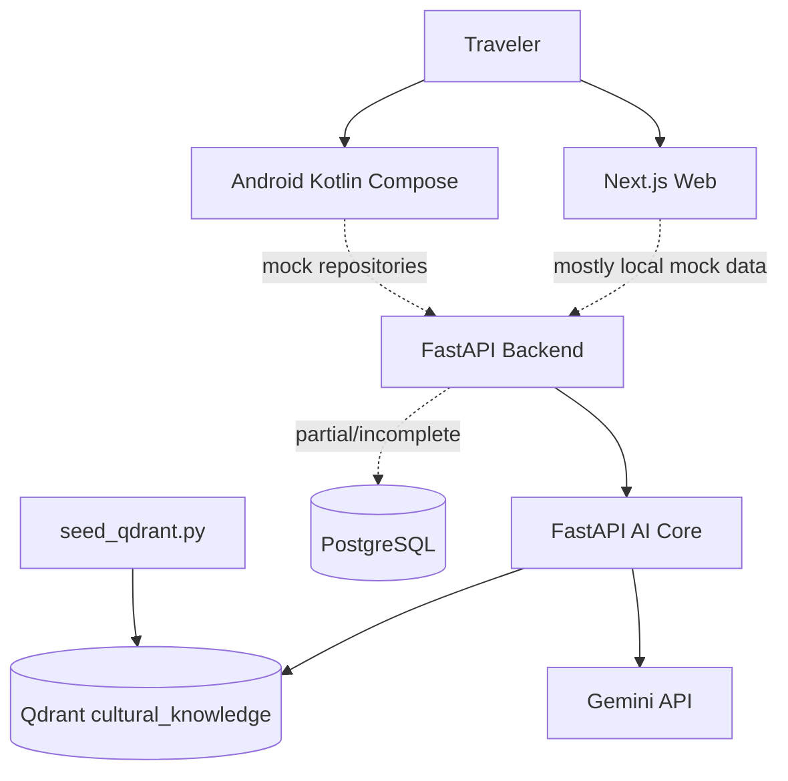
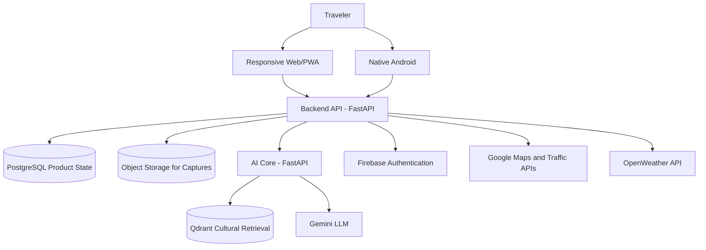
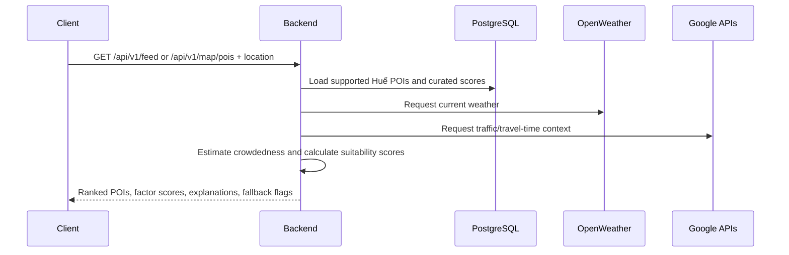
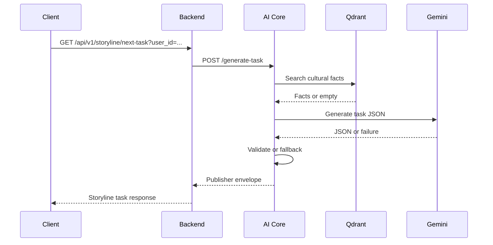
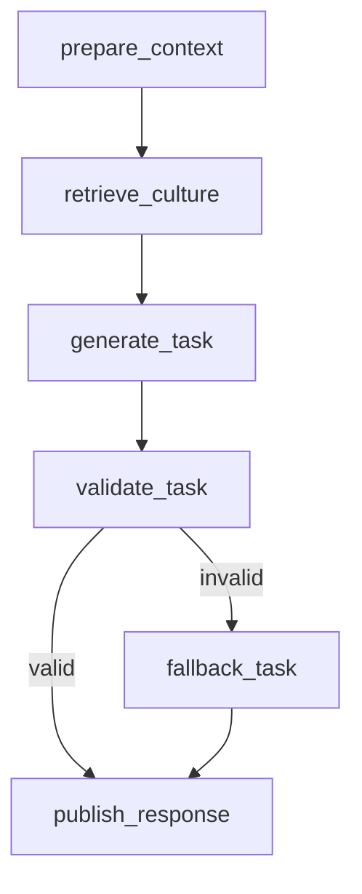

# BeVietnam — Huế Pilot Product and Project Specification

> Authoritative consolidated documentation for the Agent-Based Smart Tourism System for Vietnam.
>
> This file replaces the previous scattered documentation under `docs/` and is intended to be the single source of truth for product, business, engineering, architecture, roadmap, risks, and implementation planning.

---

## Table of Contents

1. [Document Purpose](#1-document-purpose)
2. [Executive Summary](#2-executive-summary)
3. [Business Context and Client Need](#3-business-context-and-client-need)
4. [Product Identity](#4-product-identity)
5. [Problem Statement](#5-problem-statement)
6. [Canonical Product Direction](#6-canonical-product-direction)
7. [Target Users and Roles](#7-target-users-and-roles)
8. [Pilot Scope](#8-pilot-scope)
9. [End-to-End User Journeys](#9-end-to-end-user-journeys)
10. [Functional Requirements](#10-functional-requirements)
11. [Non-Functional Requirements](#11-non-functional-requirements)
12. [System Architecture](#12-system-architecture)
13. [Backend Specification](#13-backend-specification)
14. [AI Core and Agent Specification](#14-ai-core-and-agent-specification)
15. [Frontend Web Specification](#15-frontend-web-specification)
16. [Android Mobile Specification](#16-android-mobile-specification)
17. [Database and Storage Specification](#17-database-and-storage-specification)
18. [API Contract Specification](#18-api-contract-specification)
19. [Security, Privacy, and AI Safety](#19-security-privacy-and-ai-safety)
20. [Testing Strategy](#20-testing-strategy)
21. [Deployment and Operations](#21-deployment-and-operations)
22. [Engineering Roadmap](#22-engineering-roadmap)
23. [Open Questions](#23-open-questions)
24. [Risks and Mitigations](#24-risks-and-mitigations)
25. [Documentation Audit and Historical Notes](#25-documentation-audit-and-historical-notes)
26. [Architecture Decision Records](#26-architecture-decision-records)
27. [Glossary](#27-glossary)
28. [Source Evidence Map](#28-source-evidence-map)
29. [Final Build Guidance](#29-final-build-guidance)

---

# 1. Document Purpose

This document explains BeVietnam from end to end so that developers can understand the business needs of the client and build the application correctly.

It consolidates the previous project documents that were spread across `docs/`, including:

- project specification;
- end-to-end product specification;
- architecture document;
- roadmap;
- open questions;
- documentation audit;
- Agile kickoff plan;
- database design workbench;
- recommendation database notes;
- AI Quest Maker and Culture Scout demo notes;
- architecture decision records.

The goal is to make the project understandable, truthful, consistent, and executable.

This document should be used by:

- developers implementing features;
- technical leads planning architecture;
- product owners explaining the client need;
- AI engineers building agent workflows;
- backend engineers designing APIs and persistence;
- frontend engineers building web and Android user flows;
- stakeholders evaluating the business value of the system.

---

# 2. Executive Summary

BeVietnam is a location-aware cultural tourism application for Vietnam. Its primary experience is a dynamic recommendation feed and bubble map that help travelers decide which culturally meaningful places are good to visit now. Recommendations respond to the traveler's current location, weather, traffic, estimated crowdedness, and the cultural value of each place.

The secondary experience is a storyline game. When travelers visit a supported locality, they can follow connected geocaching-style cultural tasks, travel to places, check in using GPS, and submit photos.

The project currently contains four major technical parts:

1. a FastAPI backend;
2. a FastAPI AI Core service;
3. a Next.js web application;
4. a Kotlin Jetpack Compose Android application.

The repository also includes Qdrant integration for vector search and partial PostgreSQL persistence scaffolding.

The current MVP code already demonstrates parts of the storyline flow. The next project stage must turn it into a usable Huế pilot product within eight delivery days, while the web and mobile team improves the client interfaces.

Older documentation describes a broader multi-agent crawler, event-monitoring, enrichment, translation, and community moderation platform. Those ideas are valuable as future extensions, but they are not the current MVP because most are not implemented in code.

The canonical product direction is:

```text
Help tourists answer “Which culturally meaningful place should I visit now, and why?”
Then deepen the visit through an optional cultural storyline.
```

The pilot must support both domestic and international tourists with Vietnamese and English experiences. The final submission must include the working application and a comprehensive report covering the business problem, research, design, implementation, pilot results, and limitations.

---

# 3. Business Context and Client Need

## 3.1 Client Business Context

Vietnam has a rich tourism landscape: historical sites, cultural heritage, local food, architecture, festivals, craft traditions, and daily-life experiences. However, many digital tourism products reduce this richness to map pins, ratings, photos, and short descriptions.

The client needs a product that helps travelers choose a good place to visit under current conditions while understanding Vietnamese culture more deeply.

## 3.2 Business Problem

Travelers often face these problems:

1. **Information fragmentation**
   Travel information is scattered across Google Maps, review sites, blogs, social media, local pages, and word of mouth.

2. **Lack of cultural depth**
   Many apps show where a place is but do not explain why it matters culturally.

3. **Cultural translation gap**
   Literal translation does not explain Vietnamese traditions, food culture, historical context, or local meaning.

4. **Unclear next action**
   Travelers often know where they are but do not know what meaningful action to take there.

5. **Generic recommendation experience**
   Traditional tourism apps often recommend famous places without creating a journey or sense of discovery.

6. **Conditions change throughout the day**
   A place may be culturally valuable but currently unpleasant because of rain, traffic, distance, or crowds.

7. **Data freshness and trust issues**
   Events, opening hours, local shops, and hidden places change frequently.

## 3.3 Business Opportunity

BeVietnam can differentiate itself by combining:

- curated tourism data;
- culturally grounded AI explanations;
- dynamic location-aware recommendation scoring;
- an explainable bubble map;
- connected exploration tasks;
- capture-based progress;
- multi-platform access through Android and web;
- future travel memory generation.

Instead of only listing places, BeVietnam can explain which places are suitable now, why they are recommended, and what meaningful cultural action travelers can do there.

Example:

```text
Instead of: “Visit Hue Imperial City.”

BeVietnam says:
“Find Ngo Mon Gate and capture one architectural detail that shows royal symbolism. This gate was used for important Nguyen dynasty ceremonies.”
```

This transforms tourism discovery into guided cultural exploration.

---

# 4. Product Identity

## 4.1 Project Name

**BeVietnam**
Full academic/project title: **Agent-Based Smart Tourism System for Vietnam**

## 4.2 Product Category

Smart tourism platform with AI-assisted cultural exploration.

## 4.3 One-Sentence Pitch

BeVietnam helps travelers choose culturally meaningful places that are good to visit now and explore them through optional AI-assisted storylines.

## 4.4 Product Vision

BeVietnam should become a cultural tourism companion for Vietnam, helping travelers make better in-the-moment travel decisions, understand the meaning behind places, and complete memorable exploration tasks.

## 4.5 Mission

Help domestic and international travelers discover Vietnam with cultural depth, not just location data.

## 4.6 Product Principles

1. **Culture first** — recommendations and tasks should explain cultural meaning.
2. **Useful now** — recommendations should respond to current location and conditions.
3. **Explainable ranking** — users should understand why a place is recommended or deprioritized.
4. **Guided exploration** — storylines should tell users what meaningful action to do next.
5. **Structured AI, not uncontrolled chatbot** — AI output must be validated, grounded, and schema-based.
6. **Fallback-first reliability** — core pilot flows must work when external APIs or AI providers fail.
7. **Backend owns product state** — AI Core should not directly mutate product database tables.
8. **Start with Huế** — prove the product deeply before expanding nationwide.

---

# 5. Problem Statement

## 5.1 User Problems

| Problem | Explanation | Product Response |
|---|---|---|
| Too much scattered tourism information | Travelers must search many sources manually. | Provide one app surface for places, feed, and quest guidance. |
| Lack of cultural context | Places are shown without cultural meaning. | Add cultural explanations and retrieved facts. |
| Hard to know what is good to visit now | Weather, traffic, distance, and crowds affect the experience. | Rank nearby places dynamically and explain the score. |
| Hard to know what to do next | Travelers need actionable guidance. | Generate small exploration tasks. |
| Generic travel recommendations | Existing apps prioritize popularity, not cultural learning. | Use cultural quest chains and explanation text. |
| Language/culture barrier | Translation alone is not enough. | Support bilingual UI and culturally aware explanations. |

## 5.2 Technical Problems

The repository currently has several technical inconsistencies:

- many docs describe future features not implemented in code;
- backend uses mock data and in-memory captures;
- Android uses mock repositories;
- web pages mostly render local mock data;
- PostgreSQL exists in Docker but backend does not use it;
- database models, migrations, and repository implementations are incomplete or inconsistent;
- authentication is not implemented in backend;
- tests and CI are missing;
- several Python imports still reference `src.bevietnam.*` even though current services live under `services/`, which may block reliable startup.

## 5.3 Why the Project Matters

The project matters because it demonstrates a practical and controlled use of AI in tourism:

- retrieval grounds cultural content;
- task generation gives users action;
- validation reduces unsafe or malformed output;
- fallbacks keep the product reliable;
- captures connect digital guidance to real-world exploration.

---

# 6. Canonical Product Direction

## 6.1 Most Reliable Interpretation

The canonical pilot product should be:

```text
A location-aware cultural recommendation feed and bubble map for Huế,
with optional geocaching-style cultural storylines.
```

The main loop is:

```text
Open app
→ view nearby cultural recommendations
→ understand why a place is good or poor to visit now
→ choose a place
→ optionally start a storyline
→ check in and submit photo evidence
```

## 6.2 Competing Interpretations

| Interpretation | Evidence | Problem | Decision |
|---|---|---|---|
| Dynamic cultural recommendation feed/map | Directly solves the confirmed business problem | Requires scoring, live context, and client integration | Primary pilot product |
| Cultural quest companion | Current AI Quest Maker code, backend storyline endpoints, fallback quest chain | Needs persistence and client integration | Secondary pilot experience |
| Multi-agent crawler/enrichment platform | Older decomposition docs | Not implemented, too broad | Future/legacy vision |
| AI vlog/travel memory app | README and Story Weaver stubs | Capture persistence not ready | Later phase |

## 6.3 Recommended Canonical Direction

Build one reliable Huế recommendation and storyline pilot.

Defer:

- detailed timed itinerary planning;
- advanced route optimization;
- authoritative live crowdedness;
- complex AI photo verification;
- crawler agents;
- social graph;
- full community moderation;
- advanced recommendation ML;
- nightly vlog generation;
- nationwide ingestion.

---

# 7. Target Users and Roles

## 7.1 Traveler

The traveler is the main end user. The Huế pilot targets a roughly equal mix of domestic Vietnamese tourists and international tourists.

Goals:

- discover places that are suitable to visit now;
- understand recommendation reasons;
- compare nearby places through a feed and bubble map;
- understand cultural meaning;
- follow guided tasks;
- submit captures;
- track progress;
- use Vietnamese or English UI.

## 7.2 Project Team / Operator

The project team seeds demo data, runs the stack, validates AI behavior, and improves product quality.

Goals:

- run reliable demos;
- inspect API and AI behavior;
- seed cultural data;
- debug backend and AI workflows.

## 7.3 Future Admin / Moderator

Not part of the Huế pilot, but likely needed later.

Future responsibilities:

- review community submissions;
- approve cultural documents;
- inspect flagged captures;
- moderate generated content;
- manage place and quest data.

---

# 8. Pilot Scope

## 8.1 Pilot Goal

The eight-day pilot build must prove this core value:

```text
A traveler in Huế can quickly find a culturally meaningful place that is suitable
to visit now, understand why it is recommended, and optionally complete a cultural storyline.
```

The product and comprehensive report must be complete within eight days, leaving one day before submission.

## 8.2 Pilot Must-Have Features

| Feature | Description | Priority |
|---|---|---|
| Curated Huế places | User can browse pilot POIs with sourced cultural information. | P0 |
| Dynamic recommendation feed | User sees ranked place posts based on current context. | P0 |
| Explainable ranking | Each recommendation explains important positive and negative factors. | P0 |
| Bubble map | All pilot POIs remain visible; bubble size reflects current suitability. | P0 |
| Weather integration | OpenWeather data affects recommendation scores. | P0 |
| Traffic integration | Google API traffic or travel-time data affects recommendation scores. | P0 |
| Estimated crowdedness | A clearly labeled estimate affects ranking; it is never presented as authoritative live data. | P0 |
| Cultural knowledge retrieval | Recommendations and tasks use curated official-government cultural sources. | P0 |
| Quest chain | User can view and complete connected cultural tasks. | P0 |
| GPS + photo completion | Storyline completion requires GPS proximity and submitted photo evidence. | P0 |
| Firebase Authentication | Guests browse; authenticated users save progress and captures. | P0 |
| Persistent storage | Places, progress, and capture metadata survive restart. | P0 |
| Reliable fallbacks | Core flows work when AI or context providers fail. | P0 |
| Bilingual experience | Core content and labels support Vietnamese and English. | P0 |

## 8.3 Pilot Non-Goals

Do not block the pilot on:

- native iOS;
- production crawler pipeline;
- full social network;
- public community contributions;
- real video generation;
- complex recommendation ML;
- advanced admin portal;
- nationwide place database;
- detailed timed itineraries;
- advanced route optimization;
- authoritative live crowdedness;
- complex AI image verification.

## 8.4 Confirmed Pilot Locality

The complete pilot scope is **Huế**. Other Vietnamese locations may appear as limited fallback or demonstration content, but complete data quality, recommendation scoring, and storylines are required only for Huế.

## 8.5 Pilot Success Metrics

The team will run a small survey with at least 10 tourists, targeting an approximately 50/50 mix of domestic and international participants.

| Metric | Success Threshold |
|---|---|
| Participants | At least 10 tourists |
| Recommendation usefulness | At least 70% rate recommendations as useful |
| Cultural learning | At least 60% report learning new Vietnamese cultural information |
| Storyline engagement | At least 50% complete at least one storyline task |

The report must describe recruitment, survey questions, observed behavior, results, limitations, and recommended next steps.

## 8.6 Submission Report Requirements

The comprehensive report is a required project output, not an optional documentation task. It must include:

1. the real tourist pain point and business case;
2. competitor, user, and cultural-source research;
3. confirmed product scope and target users;
4. system architecture and key technical decisions;
5. explainable recommendation-scoring design;
6. LangGraph agent and cultural knowledge-base design;
7. implementation results and test evidence;
8. tourist pilot method, survey data, and analysis;
9. privacy, cultural reliability, limitations, and risks;
10. conclusions and prioritized future work.

Claims in the report must distinguish implemented behavior, pilot observations, assumptions, and proposed future work.

---

# 9. End-to-End User Journeys

## 9.1 Journey 1 — First-Time Traveler Opens the App

### User Story

As a traveler, I want to open the app and quickly understand what I can explore, so that I can start my cultural journey without confusion.

### Flow

1. User opens web or Android app.
2. App displays home/explore navigation.
3. App obtains or requests the user's location.
4. User sees recommended places, recommendation reasons, and the bubble map.
5. User can switch language between Vietnamese and English.
6. User opens a place, feed item, or storyline quest.

### Acceptance Criteria

```text
Given the user opens the app,
When the home or explore page loads,
Then the user sees tourism places or recommendations with clear navigation.
```

```text
Given the user changes language,
When the UI rerenders,
Then core labels display in the selected language.
```

## 9.2 Journey 2 — Traveler Browses Places

### User Story

As a traveler, I want to browse tourism places by category so that I can choose a destination matching my interests.

### Flow

1. Client calls `GET /api/v1/places`.
2. Backend returns places.
3. Client displays place cards.
4. User filters by category.
5. User opens place detail.

### Required Place Fields

| Field | Meaning |
|---|---|
| `id` | Stable identifier |
| `name` | Display name |
| `category` | Place category |
| `description` | Short description |
| `latitude` | Coordinate |
| `longitude` | Coordinate |
| `image_url` | Optional image |
| `reference_url` | Optional source/reference |

### Acceptance Criteria

```text
Given places exist in the database,
When a client requests places,
Then the backend returns paginated place data in a stable schema.
```

## 9.3 Journey 3 — Traveler Views Dynamic Recommendation Feed

### User Story

As a traveler, I want to see places that are suitable to visit now so that I can make a good travel decision without researching multiple applications.

### Flow

1. Client calls `GET /api/v1/feed`.
2. Backend obtains available weather and traffic context and calculates estimated crowdedness.
3. Backend scores and ranks Huế POIs.
4. Each item includes cultural information, score factors, and an explanation.
5. Client displays the ranked places as feed posts.

### Pilot Ranking Factors

- cultural value;
- distance from the user;
- current weather suitability;
- Google traffic or travel-time conditions;
- estimated crowdedness;
- category or preference match when available.

Cultural value provides a stable baseline. Current conditions adjust whether the place is recommended now. Each score must expose its factor values and a human-readable explanation.

### Acceptance Criteria

```text
Given a user opens the feed,
When the client requests feed items,
Then the backend returns recommendations with explanation text.
```

```text
Given one or more context providers fail,
When recommendations are calculated,
Then the backend uses documented fallback values and marks unavailable factors.
```

## 9.4 Journey 4 — Traveler Uses Bubble Map

### User Story

As a traveler, I want to compare nearby cultural places visually so that I can quickly see which places are good to visit now.

### Flow

1. Client requests scored Huế POIs using the user's location.
2. Client renders every supported POI on the map.
3. Bubble size represents the current suitability score.
4. User selects a bubble to see cultural information and score explanations.
5. A culturally important place with poor current conditions remains visible with a smaller bubble.

### Acceptance Criteria

```text
Given supported Huế POIs exist,
When the bubble map loads,
Then every POI is visible and its bubble size reflects the same score used by the feed.
```

```text
Given a POI has poor current conditions,
When it is displayed,
Then it remains visible and the UI explains why it is currently deprioritized.
```

## 9.5 Journey 5 — Traveler Starts a Cultural Quest

### User Story

As a traveler, I want to follow a connected cultural quest so that exploration feels like a guided journey.

### Flow

1. User opens storyline page.
2. Client requests quest chain.
3. Backend returns tasks with status.
4. UI renders path nodes.
5. User selects active task.

### Quest Task Statuses

- `locked`
- `active`
- `completed`

### Acceptance Criteria

```text
Given a user has a quest,
When the client requests the quest chain,
Then the backend returns all task nodes with correct status.
```

## 9.6 Journey 6 — AI Core Generates the Next Task

### User Story

As a traveler, I want the next task to be meaningful and culturally grounded so that I know what to do next.

### Flow

1. Client calls backend for next task.
2. Backend calls AI Core.
3. AI Core prepares context.
4. Culture Scout retrieves cultural context from Qdrant.
5. Quest Maker calls Gemini for structured task JSON.
6. Safety Keeper validates output.
7. If invalid or failed, fallback task is used.
8. Publisher wraps response.
9. Backend returns task to client.

### Acceptance Criteria

```text
Given AI Core is available,
When backend requests a generated task,
Then AI Core returns one valid structured task.
```

```text
Given Gemini or Qdrant fails,
When backend requests a generated task,
Then AI Core returns a safe fallback task.
```

## 9.7 Journey 7 — Traveler Submits Capture Evidence

### User Story

As a traveler, I want to submit a photo or media reference to prove I completed a task, so that I can unlock the next step.

### Flow

1. User completes active task.
2. Client confirms the user is within the task's configured GPS radius.
3. User submits a photo.
4. Backend stores capture metadata and validates GPS proximity.
5. Optional AI image analysis may provide feedback but does not block completion.
6. Backend updates task attempt.
7. If GPS and photo requirements pass, the next task unlocks.

### Verification Statuses

- `approved`
- `rejected`
- `needs_review`

### Acceptance Criteria

```text
Given the user submits valid capture metadata,
When backend receives the capture,
Then it stores the capture and returns a capture id.
```

```text
Given the user is inside the required GPS radius and submits a photo,
When rule-based verification completes,
Then the active task is marked completed and the next task is unlocked.
```

---

# 10. Functional Requirements

| ID | Requirement | Priority | Current Status |
|---|---|---|---|
| FR-001 | The system shall expose a backend health endpoint. | P0 | Implemented |
| FR-002 | The system shall allow travelers to browse tourism places. | P0 | Mock implemented |
| FR-003 | The system shall filter places by category. | P0 | Mock implemented |
| FR-004 | The system shall show recommendation feed items with explanations. | P0 | Mock implemented |
| FR-005 | The system shall return a quest chain for a user. | P0 | Partial |
| FR-006 | The system shall return the next active cultural task. | P0 | Partial |
| FR-007 | The system shall generate or fallback to structured task JSON. | P0 | Partial |
| FR-008 | The system shall validate generated AI task output. | P0 | Basic implemented |
| FR-009 | The system shall allow capture metadata submission. | P0 | In-memory only |
| FR-010 | The system shall verify capture evidence. | P0 | Demo rule-based |
| FR-011 | The system shall persist user quest progress. | P0 | Planned |
| FR-012 | The system shall support user authentication. | P0 | UI/mock only |
| FR-013 | The system shall support bilingual UI labels. | P1 | Partial web support |
| FR-014 | The system shall seed cultural knowledge into Qdrant. | P1 | Script exists |
| FR-015 | The system shall fall back safely when AI services fail. | P0 | Implemented in several layers |
| FR-016 | The system shall expose stable OpenAPI-compatible contracts. | P1 | FastAPI supports this, but contracts are not formalized |
| FR-017 | The system shall rank Huế POIs using cultural value, distance, weather, traffic, and estimated crowdedness. | P0 | Planned |
| FR-018 | The system shall expose score factors and explanations for every recommendation. | P0 | Planned |
| FR-019 | The system shall render all supported POIs on a bubble map using the same suitability score as the feed. | P0 | Planned |
| FR-020 | The system shall obtain weather context from OpenWeather with fallback values. | P0 | Planned |
| FR-021 | The system shall obtain traffic or travel-time context from Google APIs with fallback values. | P0 | Planned |
| FR-022 | The system shall label crowdedness as an estimate derived from documented rules. | P0 | Planned |
| FR-023 | The system shall allow guest access to feed, map, and place details. | P0 | Planned |
| FR-024 | The system shall verify Firebase identity before saving user-owned progress or captures. | P0 | Planned |
| FR-025 | The system shall require GPS proximity and a photo to complete a storyline task. | P0 | Planned |
| FR-026 | The system shall store source metadata for every cultural knowledge chunk. | P0 | Planned |
| FR-027 | The system shall provide Vietnamese and English core content for the Huế pilot. | P0 | Partial |

---

# 11. Non-Functional Requirements

| ID | Category | Requirement | Target |
|---|---|---|---|
| NFR-001 | Reliability | P0 flows must work without Gemini by using fallbacks. | No blank task screen |
| NFR-002 | Security | User-owned routes must require authentication. | No anonymous access to private captures/progress |
| NFR-003 | Privacy | Media upload must define storage, ownership, deletion, and retention. | Policy before production upload |
| NFR-004 | AI Safety | Cultural claims should be grounded in retrieved or curated facts. | Use Qdrant/source metadata or fallback |
| NFR-005 | Latency | Realtime task generation should avoid multi-call AI chains. | One vector search + one LLM call |
| NFR-006 | Maintainability | Backend, web, Android, and AI Core contracts should stay aligned. | OpenAPI/shared schemas |
| NFR-007 | Testability | P0 endpoints and AI fallbacks must have automated tests. | CI runs tests before merge |
| NFR-008 | Observability | AI fallback, errors, and latency should be logged. | Request logs include fallback flag |
| NFR-009 | Deployment | Local stack should run consistently through Docker Compose. | One command local startup |
| NFR-010 | Accessibility | Web forms and navigation should be accessible. | Labels, contrast, keyboard support |
| NFR-011 | Explainability | Feed and bubble map must expose the main factors affecting each score. | No unexplained ranking |
| NFR-012 | Context reliability | External API failure must not prevent feed or map rendering. | Fallback score returned |
| NFR-013 | Source traceability | Cultural facts must retain official source title, URL, and page or section when available. | Traceable knowledge chunks |
| NFR-014 | Pilot performance | Feed and map should become usable quickly on a normal mobile connection. | First usable result within 5 seconds |

---

# 12. System Architecture

## 12.1 Current Architecture Summary

The repository currently contains:

- `services/backend/` — FastAPI backend service;
- `services/ai/` — FastAPI AI Core service;
- `services/web/` — Next.js web app;
- `mobile/` — Kotlin Jetpack Compose Android app;
- `database/` — PostgreSQL schema and Alembic migration scaffolding;
- `scripts/data-pipeline/` — cultural ingestion, Qdrant seeding, and Google Sheets utilities.

## 12.2 Current Architecture Diagram



## 12.3 Recommended Target Architecture



## 12.4 Component Responsibilities

| Component | Responsibility | Current Status |
|---|---|---|
| Web app | Browser UI for discovery, auth, contribute, events, storyline | Partial/mock |
| Android app | Native mobile experience with Compose screens | Partial/mock |
| Backend API | Product APIs, persistence, auth, AI proxy | Partial/mock |
| AI Core | Retrieval, task generation, validation, verification | Partial; Quest Maker strongest |
| PostgreSQL | Durable product state | Connection and migrations exist; repositories incomplete |
| Qdrant | Cultural vector search | Wired in AI Core |
| Object Storage | Real capture media | Planned |
| Firebase Authentication | Identity provider; backend verifies user tokens | Confirmed, not wired |
| OpenWeather | Current weather context for recommendation scoring | Resolver with cache/fallback exists |
| Goong APIs | Current context enrichment | Existing integration; pilot must decide whether to retain or replace |
| Google APIs | Target map and traffic/travel-time context | Confirmed, not wired |
| Shared contracts | API/schema alignment | No dedicated shared-contract package |

## 12.5 Main Data Flow: Dynamic Recommendation



## 12.6 Main Data Flow: Storyline Task



---

# 13. Backend Specification

## 13.1 Current Backend

Backend is implemented with FastAPI.

Main files:

- `services/backend/app/main.py`
- `services/backend/app/api/router.py`
- `services/backend/app/api/endpoints/health.py`
- `services/backend/app/api/endpoints/places.py`
- `services/backend/app/api/endpoints/feed.py`
- `services/backend/app/api/endpoints/storyline.py`
- `services/backend/app/api/endpoints/captures.py`
- `services/backend/app/api/endpoints/logs.py`
- `services/backend/app/core/ai_core_client.py`
- `services/backend/app/core/config.py`
- `services/backend/app/schemas/`

## 13.2 Current Backend Capabilities

| Capability | Status |
|---|---|
| Health endpoint | Implemented |
| Places endpoint | Mock list |
| Feed endpoint | Mock list |
| Storyline endpoints | Partial with AI Core/fallback |
| Capture creation | In-memory only |
| Logs endpoint | Mock logs |
| Auth | Not implemented |
| Database access | Connection/session scaffolding exists; repositories incomplete |
| Migrations | Alembic scaffolding and draft migrations exist; needs verification |
| Tests | Missing |

## 13.3 Required Backend Improvements

1. Correct and verify the PostgreSQL connection/session layer.
2. Complete and verify Alembic migrations.
3. Complete repositories for users, places, quests, captures, attempts, and recommendation context.
4. Replace mock places with database data.
5. Replace in-memory captures with persisted captures.
6. Verify Firebase ID tokens and authorize user-owned routes.
7. Protect user-owned routes.
8. Integrate OpenWeather and Google traffic/travel-time context with timeouts and fallbacks.
9. Implement one explainable recommendation scoring service shared by feed and map APIs.
10. Add API tests.
11. Generate or document OpenAPI contracts for clients.
12. Restrict CORS in production.

## 13.4 Recommendation Scoring Specification

The pilot should use a transparent weighted score rather than complex machine learning. Exact weights may be tuned during development and pilot testing, but must be documented in the report.

```text
suitability_score =
  0.30 × cultural_value_score
  + 0.20 × distance_score
  + 0.15 × weather_score
  + 0.15 × traffic_score
  + 0.15 × estimated_crowdedness_score
  + 0.05 × optional_preference_score
```

Rules:

- use the weights above as the initial pilot default and tune only with documented reasoning;
- normalize the final score to a stable client range such as `0–100`;
- keep every supported POI visible even when its score is low;
- use the same score and factors for feed ranking and bubble-map sizing;
- return factor scores, context timestamps, fallback flags, and an explanation;
- treat cultural value as a stable curated baseline;
- label crowdedness as estimated;
- use deterministic fallback values when OpenWeather or Google APIs fail.

Weather suitability must consider POI characteristics such as indoor/outdoor exposure, rather than treating the same weather as equally suitable for every place.

The initial estimated crowdedness model may use POI category, manually curated popularity, weekday, time of day, weather, and BeVietnam check-ins when available.

---

# 14. AI Core and Agent Specification

## 14.1 Current AI Core

AI Core is implemented with FastAPI and contains several agents.

Main files:

- `services/ai/main.py`
- `services/ai/api/routes.py`
- `services/ai/common/config.py`
- `services/ai/common/llm.py`
- `services/ai/common/qdrant_store.py`
- `services/ai/common/schemas.py`
- `services/ai/agents/culture_scout/agent.py`
- `services/ai/agents/quest_maker/workflow.py`
- `services/ai/agents/quest_maker/nodes.py`
- `services/ai/agents/safety_keeper/agent.py`
- `services/ai/agents/publisher/agent.py`
- `services/ai/agents/capture_judge/agent.py`
- `services/ai/agents/trip_advisor/agent.py`
- `services/ai/agents/memory_curator/agent.py`
- `services/ai/agents/story_weaver/agent.py`

## 14.2 AI Core Stack

| Layer | Technology |
|---|---|
| API | FastAPI |
| Workflow | LangGraph |
| LLM | Gemini via `google-genai` |
| Vector DB | Qdrant |
| Embeddings | `BAAI/bge-m3` via Hugging Face Inference API |
| Validation | Pydantic + Safety Keeper rules |

## 14.3 Agent Responsibilities

| Agent | Responsibility | Current Status |
|---|---|---|
| Culture Scout | Retrieve cultural facts from Qdrant/fallback | Partial/active |
| Quest Maker | Generate structured cultural task | Partial/active |
| Safety Keeper | Validate required fields and basic safety | Basic implemented |
| Publisher Agent | Wrap output in standard envelope | Implemented |
| Capture Judge | Verify capture evidence | Demo rule-based |
| Trip Advisor | Explain recommendation | Stub |
| Memory Curator | Select captures for travel memory | Stub |
| Story Weaver | Generate travel memory text | Stub |

## 14.4 Quest Maker Workflow



## 14.5 AI Rules

- AI Core returns structured JSON.
- AI Core should not directly write to PostgreSQL product tables.
- Retrieval should happen before generation when possible.
- Every AI workflow needs fallback behavior.
- Safety validation must run before returning output to users.
- Generated tasks must be safe and realistic.
- Cultural claims and storyline tasks must be grounded in the curated Huế knowledge base.
- AI output must preserve or return source references used for generation.
- AI-generated text must not override deterministic suitability scores.
- AI image analysis may provide feedback but must not block pilot storyline completion.

## 14.6 Cultural Knowledge Base

The Huế pilot knowledge base will be curated from Vietnamese government sources. Ebook and other source research will continue during implementation, but content must not enter the production pilot collection without source verification.

Each knowledge chunk must include:

- chunk text in Vietnamese and/or English;
- source title;
- official organization or publisher;
- official URL or document identifier;
- page, chapter, or section when available;
- related POI identifiers;
- language;
- ingestion or review date.

The team may write summaries or translations, but these must retain links to the official source material. Unsupported cultural claims must be removed or clearly marked for review.

---

# 15. Frontend Web Specification

## 15.1 Current Web Stack

- Next.js 16
- React 19
- TypeScript
- CSS modules/global styles
- App Router

Main files:

- `services/web/package.json`
- `services/web/src/app/page.tsx`
- `services/web/src/app/explore/page.tsx`
- `services/web/src/app/events/page.tsx`
- `services/web/src/app/storyline/page.tsx`
- `services/web/src/app/auth/login/page.tsx`
- `services/web/src/app/auth/register/page.tsx`
- `services/web/src/app/contribute/page.tsx`
- `services/web/src/i18n/translations.ts`

## 15.2 Current Web Capabilities

| Page | Status |
|---|---|
| Home | Implemented with local mock data |
| Explore | Implemented with local mock data |
| Events | Implemented with local mock data |
| Storyline | Implemented with local mock path, not backend-integrated |
| Login/Register | UI only |
| Contribute | UI only |
| Place/Event details | Placeholder detail pages |

## 15.3 Required Web Improvements

1. Connect explore page to backend `/places`.
2. Connect feed/recommendation surfaces to backend `/feed`.
3. Render bubble map from `/map/pois` using the same score shown in the feed.
4. Connect storyline page to backend `/storyline/quest` and `/storyline/next-task`.
5. Integrate Firebase Authentication and attach ID tokens to protected requests.
6. Add loading/error/empty/fallback states.
7. Remove hardcoded mock arrays from production paths.
8. Use generated/shared API types if possible.

---

# 16. Android Mobile Specification

## 16.1 Current Android Stack

- Kotlin
- Jetpack Compose
- Hilt
- Compose Navigation
- Retrofit/OkHttp dependencies
- Coroutines/Flow

Main folders:

- `mobile/app/src/main/java/com/bevietnam/core/model`
- `mobile/app/src/main/java/com/bevietnam/core/domain`
- `mobile/app/src/main/java/com/bevietnam/core/data/mock`
- `mobile/app/src/main/java/com/bevietnam/core/data/remote`
- `mobile/app/src/main/java/com/bevietnam/ui/screens`
- `mobile/app/src/main/java/com/bevietnam/ui/navigation`

## 16.2 Current Android Capabilities

| Capability | Status |
|---|---|
| Compose UI shell | Implemented |
| Navigation | Implemented |
| Auth screen | Mock-backed |
| Profile screen | Mock-backed |
| Explore/feed/storyline screens | Mock-backed |
| Remote API client | Mostly empty |
| Hilt DI | Binds mock repositories |

## 16.3 Required Android Improvements

1. Implement Retrofit API interface.
2. Implement network module.
3. Integrate Firebase Authentication and attach ID tokens to protected requests.
4. Render feed and map using shared backend suitability scores.
5. Replace mock repositories with remote repositories gradually.
6. Add ViewModel tests.
7. Add loading/error/fallback states from backend responses.
8. Integrate GPS + photo capture flow with backend API.

---

# 17. Database and Storage Specification

## 17.1 Database Decision

The project should use PostgreSQL for product state.

Reason:

- Docker Compose already uses PostgreSQL.
- Docs recommend PostgreSQL.
- PostgreSQL supports future PostGIS/geospatial features.
- SQL draft can be converted conceptually.

The current `database/schema.sql` and Alembic migrations require verification against the SQLAlchemy models before they are treated as authoritative runtime migrations.

## 17.2 P0 Tables

### `users`

Stores user identity.

Fields:

- `id`
- `email`
- `status`
- `created_at`
- `updated_at`

### `user_profiles`

Stores traveler profile.

Fields:

- `user_id`
- `display_name`
- `avatar_url`
- `preferred_language`
- `nationality`
- `timezone`

### `places`

Stores tourism places.

Fields:

- `id`
- `name`
- `category`
- `description`
- `latitude`
- `longitude`
- `image_url`
- `reference_url`
- `cultural_value_score`
- `manual_popularity_score`
- `visit_environment` (`indoor`, `outdoor`, or `mixed`)
- `recommended_weather_conditions`
- `created_at`
- `updated_at`

### `quest_chains`

Stores storyline/quest definitions.

Fields:

- `id`
- `place_id`
- `title`
- `description`
- `locality`
- `status`

### `quest_tasks`

Stores tasks inside quests.

Fields:

- `id`
- `quest_id`
- `step_index`
- `title`
- `description`
- `cultural_explanation`
- `completion_requirement`
- `unlock_condition`
- `difficulty`
- `latitude`
- `longitude`
- `completion_radius_meters`

### `user_quest_progress`

Stores user progress.

Fields:

- `user_id`
- `quest_id`
- `current_step`
- `status`
- `started_at`
- `completed_at`

### `captures`

Stores capture metadata.

Fields:

- `id`
- `user_id`
- `place_id`
- `task_id`
- `media_key`
- `media_url`
- `latitude`
- `longitude`
- `note`
- `created_at`

### `task_attempts`

Stores completion attempts.

Fields:

- `id`
- `user_id`
- `quest_task_id`
- `capture_id`
- `status`
- `reason`
- `confidence`
- `created_at`

### `recommendation_snapshots`

Stores recommendation inputs and outputs needed for debugging and pilot analysis.

Fields:

- `id`
- `user_id` (nullable for guests)
- `place_id`
- `suitability_score`
- `factor_scores`
- `explanation`
- `fallback_flags`
- `context_timestamp`
- `created_at`

## 17.3 P1/P2 Tables

Future tables may include:

- `interests`
- `user_interest_state`
- `user_interest_events`
- `place_interests`
- `recommendation_requests`
- `recommendation_results`
- `ai_jobs`
- `vlog_posts`
- `community_submissions`
- `cultural_documents`

## 17.4 Storage Boundary

| Store | Responsibility |
|---|---|
| PostgreSQL | Users, places, quest state, captures metadata, attempts |
| Object Storage | Uploaded photos/videos and generated media |
| Qdrant | Cultural document embeddings |
| External APIs | Weather, map/geocoding, future context data |

Rule:

```text
Do not store raw image/video bytes in PostgreSQL.
```

---

# 18. API Contract Specification

## 18.1 Backend APIs

| Method | Path | Purpose | Status |
|---|---|---|---|
| GET | `/api/v1/health` | Backend health | Implemented |
| GET | `/api/v1/places` | List/filter places | Mock implemented |
| GET | `/api/v1/feed` | Dynamic recommendation feed with score explanations | Mock implemented |
| GET | `/api/v1/map/pois` | Scored POIs for bubble-map rendering | Needed |
| GET | `/api/v1/storyline/quest` | Quest chain | Partial |
| GET | `/api/v1/storyline/next-task` | Next task | Partial |
| POST | `/api/v1/storyline/verify-capture` | Verify capture | Partial |
| POST | `/api/v1/captures` | Create capture | In-memory |
| GET | `/api/v1/logs` | Debug logs | Mock |
| GET | `/api/v1/me` | Current user profile | Needed |

Clients authenticate directly with Firebase Authentication. The backend must verify Firebase ID tokens for protected routes; it must not implement a competing password system.

Feed and map responses must include:

- suitability score;
- normalized factor scores;
- explanation text;
- context timestamp;
- fallback flags;
- place cultural summary and source references.

## 18.2 AI Core APIs

| Method | Path | Purpose | Status |
|---|---|---|---|
| GET | `/health` | AI health | Implemented |
| POST | `/generate-task` | Generate cultural task | Partial |
| GET | `/quest-chain` | Fallback quest chain | Implemented fallback |
| POST | `/explain-recommendation` | Explain recommendation | Stub |
| POST | `/verify-capture` | Verify capture | Demo rule-based |
| POST | `/generate-vlog` | Generate travel memory | Stub |

## 18.3 Required Contract Strategy

Use FastAPI OpenAPI as the backend source of truth.

Recommended:

1. keep backend Pydantic schemas stable;
2. generate TypeScript types for web;
3. generate or manually mirror Kotlin DTOs for Android;
4. store generated or reviewed contracts in `shared/contracts` or `shared/schemas`.

---

# 19. Security, Privacy, and AI Safety

## 19.1 Current Security Risks

| Risk | Severity | Current Evidence | Required Fix |
|---|---|---|---|
| Open CORS | High | Backend allows `*` origins | Restrict production origins |
| No backend auth verification | High | No auth middleware | Verify Firebase ID tokens before user data |
| In-memory captures | Medium | `_captures` list | Persist in DB |
| Arbitrary media URL/data URL | High | Capture accepts media URL | Validate uploads and use object storage |
| LocalStorage bearer token pattern | Medium | Web API client reads token from localStorage | Use secure cookie or strict XSS controls |
| Default DB credentials | Medium | Compose defaults | Use secrets outside local demo |
| Prompt injection/data poisoning | Medium | Cultural docs feed retrieval | Curate sources, validate ingestion |
| LLM hallucination | Medium | Gemini generation | Require grounding and validation |
| No rate limiting | Medium | No limiter visible | Add rate limits for auth/capture/AI endpoints |

## 19.2 Privacy Requirements

The system may process:

- user identity;
- location metadata;
- photos/videos;
- travel behavior;
- preferences;
- generated memories.

Required privacy rules:

- captures are private by default;
- users can delete captures;
- media retention policy must be defined;
- exact location should not be exposed publicly without consent;
- only necessary user context should be sent to AI providers.
- guest recommendation requests should not create identifiable profiles.

## 19.3 AI Safety Rules

AI-generated tasks must not:

- ask users to enter restricted/private/dangerous areas;
- invent unsupported cultural facts;
- produce offensive or disrespectful cultural content;
- require unsafe behavior;
- expose private user data.

AI outputs must:

- follow schema;
- include cultural explanation;
- be short enough for UI;
- use fallback if invalid;
- be grounded in retrieved or curated facts where possible.
- retain traceable official source references for cultural claims.

---

# 20. Testing Strategy

## 20.1 Current Testing State

Current repository has minimal testing scaffolding and no meaningful test suite.

Observed:

- `services/backend/tests/.gitkeep` only;
- Android has Gradle test dependencies;
- no CI workflow found;
- no AI workflow tests found;
- no web route tests found.

## 20.2 Required Tests

| Test Area | Required Tests | Priority |
|---|---|---|
| Backend health | `GET /health` returns status | P0 |
| Places | list, filter, pagination | P0 |
| Feed | returns explanations and valid scores | P0 |
| Recommendation scoring | deterministic factors, normalization, fallback behavior | P0 |
| Bubble map API | same scores as feed; all POIs returned | P0 |
| Context integrations | OpenWeather/Google success, timeout, and fallback paths | P0 |
| Auth | valid/invalid Firebase tokens and unauthorized rejection | P0 |
| Quest | chain state, active/locked/completed behavior | P0 |
| AI fallback | Gemini/Qdrant failure returns fallback | P0 |
| Capture | create capture, reject invalid evidence, verify status | P0 |
| Persistence | state survives backend restart | P0 |
| Web | pages render and call correct APIs | P1 |
| Android | ViewModel loading/success/error | P1 |
| Security | CORS/auth/upload/rate-limit tests | P0 before deployment |
| Knowledge base | official-source metadata and retrieval grounding | P0 |

---

# 21. Deployment and Operations

## 21.1 Current Local Stack

`docker-compose.yaml` defines:

- `backend` service;
- `web` service;
- `postgres-db` service.

AI Core currently runs outside Compose. Qdrant may use Qdrant Cloud, embedded local storage, or a separately configured server.

Ports:

- web: `3000`
- backend: `8000`
- AI Core: `8001` when run locally outside Compose
- Qdrant: `6333` when a local server is configured
- PostgreSQL: `4000` on host → `5432` container

## 21.2 Operational Gaps

- Dockerfiles use Uvicorn `--reload`, suitable for development only.
- No production deployment target is defined.
- No CI/CD workflows found.
- No database migration runner.
- No backup strategy.
- No object storage.
- No monitoring/tracing.
- No secret management beyond environment variables.

## 21.3 Demo Runbook

Recommended pilot/demo flow:

1. Start Docker Compose stack.
2. Seed PostgreSQL with Huế places and quest data.
3. Seed Qdrant with official-source cultural data.
4. Open web app.
5. Allow location access and view the dynamic feed.
6. Open the bubble map and compare POI sizes.
7. Inspect why a highly ranked and a deprioritized place received their scores.
8. Demonstrate fallback behavior for an unavailable context provider.
9. Log in with Firebase.
10. Open a storyline and request the next task.
11. Submit GPS and photo evidence.
12. Show the next task unlocked and progress persisted.

---

# 22. Engineering Roadmap

## 22.1 Delivery Constraint

The working application and comprehensive report must be completed within eight days, leaving one day before submission. The team has five members, with teammates primarily improving web and mobile UI while backend, AI services, integrations, data quality, pilot operation, and report evidence remain critical shared work.

## 22.2 Eight-Day Delivery Plan

| Day | Primary Outcome | Exit Criteria |
|---|---|---|
| 1 | Freeze contracts and pilot data model | Huế POI schema, scoring factors, Firebase flow, storyline rules, and API contracts agreed |
| 2 | Establish persistence and seed data | PostgreSQL migrations run; curated Huế places and storylines load successfully |
| 3 | Build recommendation context and scoring | OpenWeather and Google context adapters work; deterministic fallback scoring is tested |
| 4 | Complete feed and bubble-map APIs | Feed and map return the same explainable scores for all pilot POIs |
| 5 | Complete auth and storyline persistence | Firebase-protected progress/captures work; GPS + photo completion unlocks next task |
| 6 | Ground AI and integrate clients | Official-source Huế knowledge retrieves correctly; web/mobile use core backend APIs |
| 7 | Stabilize and run tourist pilot | Critical tests pass; at least 10 participants complete survey and observed flows |
| 8 | Fix critical findings and complete report | Pilot issues addressed; application, report, runbook, and presentation evidence ready |

## 22.3 Parallel Team Workstreams

1. **Backend and data:** persistence, recommendation scoring, context integrations, Firebase verification, APIs, tests.
2. **AI and cultural knowledge:** official-source research, chunk metadata, retrieval, grounded explanations, storyline fallbacks.
3. **Web:** feed, map, auth, storyline, bilingual UI, error states.
4. **Mobile:** feed, map, auth, storyline, bilingual UI, error states.
5. **Pilot and report:** survey preparation, participant recruitment, testing observations, business analysis, technical documentation.

## 22.4 Scope-Cut Order

If delivery risk becomes critical, reduce scope in this order while preserving the main business case:

1. remove optional AI photo feedback;
2. reduce the number of storylines;
3. reduce the number of fully curated Huế POIs;
4. simplify personalization;
5. document one client as a prototype if it cannot reliably complete the core flow.

Do not cut explainable recommendation scoring, bubble-map consistency, official-source cultural grounding, Firebase authorization for user data, or pilot measurement.

## 22.5 Post-Submission Features

Only after the Huế pilot is stable:

- interest-based recommendation ranking;
- community contribution flow;
- cultural ingestion pipeline;
- events integration;
- travel memory/vlog generation;
- admin moderation tools;
- native iOS if resources exist.

---

# 23. Open Questions

| ID | Question | Recommended Default | Blocking Level |
|---|---|---|---|
| OQ-001 | Which exact official government sources and ebooks will seed each Huế POI? | Research and record during Days 1–3 | Blocks content completion |
| OQ-002 | Should pilot evidence justify changing the initial suitability-score weights? | Keep the documented defaults unless observations show a clear problem | Not blocking |
| OQ-003 | Which Google API and billing configuration will provide traffic/travel-time context, and should it replace the existing Goong integration? | Confirm before Day 3 | Blocks live traffic |
| OQ-004 | Which object storage provider will store pilot photos? | Choose the simplest secure option already available to the team | Blocks capture upload |
| OQ-005 | How many Huế POIs and storylines can be curated to a trustworthy standard? | Freeze a realistic number on Day 1 | Blocks content scope |
| OQ-006 | Which deployment target will host the pilot? | Choose on Day 1 based on existing team access | Blocks pilot |
| OQ-007 | What exact survey questions and consent wording will be used? | Finalize before participant recruitment | Blocks report evidence |

---

# 24. Risks and Mitigations

| Risk | Impact | Probability | Mitigation |
|---|---|---|---|
| Eight-day delivery window | High | High | Freeze Huế scope, parallelize work, and follow scope-cut order |
| Scope conflict between feed/map product and legacy quest-only direction | High | High | Use this document as source of truth |
| No persistence | High | High | Implement PostgreSQL migrations and repositories |
| No backend Firebase verification | High | High | Implement token verification before user-owned routes |
| External weather/traffic API failure or quota | High | Medium | Timeouts, caching, fallback factors, and visible fallback flags |
| Crowdedness mistaken for live fact | Medium | Medium | Label as estimated and document the model |
| AI provider failure during demo | Medium | Medium | Keep fallback quest chain and mock mode |
| Qdrant/bge-m3 warm-up slow | Medium | Medium | Pre-seed/pre-warm before demo |
| Cultural hallucination | High | Medium | Require retrieval, sources, validation |
| Upload privacy risk | High | Medium | Object storage + retention/deletion policy |
| Web/Android contract drift | Medium | High | Use OpenAPI/shared schemas |
| No tests/CI | High | High | Add tests before feature expansion |
| Old docs confuse developers | Medium | High | Keep only this consolidated file |

---

# 25. Documentation Audit and Historical Notes

## 25.1 Previous Documentation Categories

Previous docs fell into these groups:

1. **Current canonical docs**
   Specification, architecture, roadmap, open questions, E2E spec, ADRs.

2. **Useful planning docs**
   Agile kickoff plan, database design workbench, recommendation database inspiration.

3. **AI demo docs**
   Quest Maker + Culture Scout demo design and implementation plan.

4. **Legacy/speculative docs**
   Cultural Brain MVP plan, older feature decomposition, project memory, submission docs, slide assets.

## 25.2 Major Documentation Conflicts Resolved

| Topic | Old/Conflicting Claim | Resolution |
|---|---|---|
| Mobile stack | React Native/Flutter/Expo in old docs | Kotlin + Jetpack Compose is current truth |
| Database | Incomplete/inconsistent schema and migrations | PostgreSQL is canonical; verify Alembic migrations and models |
| Product focus | Crawler/event/enrichment MAS or quest-only MVP | Dynamic cultural feed and bubble map first; storylines second |
| Pilot locality | TP.HCM, Hà Nội, Huế/Hội An | Huế confirmed for complete pilot |
| Styling | Tailwind mentioned | Current web uses CSS modules/global CSS |
| Auth | JWT/Firebase/Supabase/local all mentioned | Firebase Authentication confirmed |
| CI/CD | GitHub Actions mentioned | No workflow found |
| Storage | Cloud storage mentioned | Not implemented yet |

## 25.3 Historical Ideas Preserved for Future

The following ideas are not part of the pilot but remain useful later:

- crawler agent;
- event monitor agent;
- cleaner agent;
- cultural enricher agent;
- translator agent;
- feed curator agent;
- community moderator agent;
- social check-ins;
- generated travel vlog;
- recommendation debug tables;
- user interest event logs.

---

# 26. Architecture Decision Records

## ADR-0001 — Canonical MVP Direction

Status: Accepted

Decision: Use a dynamic cultural recommendation feed and bubble map as the primary Huế pilot product, with storylines as a secondary engagement experience.

Reason:

- this directly solves the confirmed tourist decision-making problem;
- it combines current conditions with cultural information;
- storylines deepen engagement without replacing the primary recommendation value;
- it is achievable within the eight-day delivery window.

Consequence:

- feed and map must share one explainable scoring service;
- crawler/event/community/vlog features are deferred.

## ADR-0002 — Use PostgreSQL for Product State

Status: Proposed

Decision: Standardize on PostgreSQL.

Reason:

- Docker Compose uses PostgreSQL;
- docs recommend PostgreSQL;
- PostGIS can support future geospatial features.

Consequence:

- convert MySQL-style SQL draft into PostgreSQL migrations.

## ADR-0003 — Keep AI Core Separate from Backend

Status: Proposed

Decision: Keep AI Core as a separate FastAPI service.

Reason:

- AI dependencies are heavy;
- AI logic evolves separately;
- backend should own product state;
- current architecture already follows this.

Consequence:

- backend and AI Core need stable internal contracts and fallback handling.

## ADR-0004 — Select Authentication Model

Status: Accepted

Decision: Use Firebase Authentication for user identity. Guests may browse feed, map, and place details. The backend verifies Firebase ID tokens before allowing storyline progress, capture upload, or other user-owned actions.

Consequence:

- clients integrate Firebase sign-in;
- backend must implement Firebase token verification and authorization;
- the backend must not implement a competing password system.

## ADR-0005 — Use Object Storage for Captures

Status: Proposed

Decision: Store media in object storage and metadata in PostgreSQL.

Reason:

- raw media should not live in relational DB;
- capture media has privacy and scaling concerns;
- object storage supports controlled access and deletion.

Consequence:

- backend needs upload validation, ownership, retention, and deletion flows.

## ADR-0006 — Explainable Rule-Based Recommendation Scoring

Status: Accepted

Decision: Use a deterministic weighted score based on cultural value, distance, weather, Google traffic/travel time, estimated crowdedness, and optional preferences.

Reason:

- the score must be explainable to tourists and evaluators;
- a rule-based model is practical within eight days;
- it supports reliable fallbacks and straightforward testing.

Consequence:

- score weights and fallback values must be documented;
- feed ordering and bubble size must use the same score;
- crowdedness must be labeled as estimated.

## ADR-0007 — Official Government Cultural Sources

Status: Accepted

Decision: The pilot cultural knowledge base will use only verified Vietnamese government sources, with traceable source metadata for every knowledge chunk.

Consequence:

- source research and curation are required pilot tasks;
- unsupported content cannot enter the production pilot collection;
- AI explanations and tasks must preserve source references.

---

# 27. Glossary

| Term | Meaning |
|---|---|
| BeVietnam | Product name for the smart tourism system |
| AI Core | Separate FastAPI service for retrieval, generation, validation, and AI workflows |
| Culture Scout | Agent that retrieves cultural facts from Qdrant/fallback facts |
| Quest Maker | Agent/workflow that generates cultural exploration tasks |
| Safety Keeper | Validator for generated task schema and basic safety |
| Publisher Agent | Component that wraps AI output in a standard response envelope |
| Capture Judge | Agent that verifies whether a capture satisfies a task |
| Quest chain | Ordered set of connected cultural tasks |
| Capture | Photo/video metadata or evidence submitted by user |
| RAG | Retrieval-augmented generation using cultural documents before LLM generation |
| Qdrant | Vector database used for cultural knowledge retrieval |
| bge-m3 | Local embedding model used for Vietnamese-friendly vector search |
| Fallback task | Curated task returned when AI generation fails |
| Product state | Durable business data owned by backend, usually in PostgreSQL |
| Suitability score | Explainable current recommendation score shared by feed and bubble map |
| Estimated crowdedness | Rule-based crowd estimate, not authoritative live occupancy data |

---

# 28. Source Evidence Map

| Claim | Evidence |
|---|---|
| Project is BeVietnam smart tourism system | Root `README.md`, web translations |
| Backend is FastAPI | `services/backend/app/main.py`, backend requirements |
| Backend exposes health/places/feed/storyline/captures/logs | `services/backend/app/api/router.py` |
| Backend data is mostly mock/in-memory | endpoint files in `services/backend/app/api/endpoints` |
| AI Core is separate FastAPI service | `services/ai/main.py`, `services/ai/api/routes.py` |
| Quest Maker uses LangGraph/Gemini/Qdrant/fallback | `services/ai/agents/quest_maker/workflow.py`, `services/ai/agents/quest_maker/nodes.py`, `services/ai/common/llm.py`, `services/ai/common/qdrant_store.py` |
| Android uses Kotlin/Compose and repository abstractions | `mobile/app/build.gradle.kts`, `mobile/app/src/main/java/com/bevietnam/core/di/RepositoryModule.kt` |
| Web uses Next.js and mostly local mock data | `services/web/package.json`, `services/web/src/app/*` |
| PostgreSQL scaffolding exists but persistence is incomplete | `docker-compose.yaml`, `services/backend/app/core/database.py`, `database/migrations/` |
| Tests and CI are missing | only `services/backend/tests/.gitkeep`; no workflows found |
| Security risks exist | wildcard CORS, missing auth, capture media_url, default local credentials |
| Pilot product decisions and success metrics | Confirmed stakeholder interview completed June 15, 2026 |

---

# 29. Final Build Guidance

Developers should build in this order:

1. Freeze the number of curated Huế POIs, storylines, score weights, API contracts, and deployment target.
2. Convert the schema to PostgreSQL migrations and seed trustworthy pilot content.
3. Implement explainable scoring with OpenWeather, Google traffic/travel time, and deterministic fallbacks.
4. Expose consistent dynamic-feed and bubble-map APIs.
5. Verify Firebase tokens and persist user-owned storyline progress and captures.
6. Ground AI explanations and tasks in official-source Huế cultural knowledge.
7. Connect web and mobile clients to the core APIs.
8. Test critical flows, run the tourist pilot, and analyze survey results.
9. Complete the report and submission evidence.
10. Only then expand into advanced AI, crawler, community, and vlog features.

The most important principle:

```text
Deliver one reliable, explainable Huế pilot that solves the tourist decision problem,
then use measured pilot evidence to justify future expansion.
```
