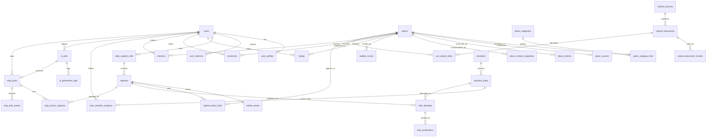

# Database Design Workbench

This document is a design workspace, not the final schema. Use it to decide the database model before writing migrations.

## 1. Current Product Surfaces

The app currently describes these backend-owned workflows:

| Surface | Main user action | Data that must persist |
|---|---|---|
| Map discovery | User opens map/feed near a location | places, categories, computed bubble metrics, weather/traffic snapshots |
| Storyline tasks | User receives and completes cultural tasks | storylines, tasks, user progress, verification results |
| Capture roll | User uploads photos for a day | captures, media metadata, storage keys, privacy status |
| Social signals | User rates/comments/checks in | ratings, comments, check-ins, sentiment aggregates |
| Vlog generation | Nightly AI creates diary/vlog post | jobs, selected captures, AI outputs, generated posts |
| Cultural brain | AI retrieves heritage knowledge | cultural documents, POI links, vector ids, source metadata |

## 2. Storage Boundary

Recommended split:

| Store | Responsibility |
|---|---|
| Postgres | relational product state, user state, places, captures, jobs, posts |
| Object storage | uploaded photos/videos and generated media files |
| Qdrant | vector embeddings for cultural documents and POI knowledge |
| External APIs | weather, traffic, map tiles, geocoding; cache only what the app needs |

Do not store raw image bytes in Postgres. Store only metadata and object keys.

## 3. Candidate Entity Groups

### Identity

Candidate tables:

- `users`
- `user_profiles`
- `user_interests`
- `user_devices`

Design decisions:

- Will auth be email/password, OAuth, Firebase, or custom JWT?
- Is `user_profiles` one row per user, or can users have multiple traveler personas?
- Are interests fixed tags or free-form preferences?

### Places And Map Intelligence

Candidate tables:

- `places`
- `place_categories`
- `place_category_links`
- `place_sources`
- `place_metrics`
- `place_context_snapshots`
- `bubble_scores`

Design decisions:

- Is a place manually seeded, scraped/imported, or user-created?
- Should bubble score be stored, computed on request, or cached with expiration?
- Do weather and traffic attach to a place, a map cell, or a request location?
- Should categories be simple strings or normalized records?

### Storyline Tasks

Candidate tables:

- `storylines`
- `storyline_steps`
- `user_storyline_progress`
- `task_attempts`
- `task_verifications`

Design decisions:

- Are storylines authored by admins, generated by AI, or both?
- Does a task belong to one place, many places, or only a geofence?
- Can users retry a failed task?
- What verification statuses are needed: `pending`, `approved`, `rejected`, `needs_review`?

### Capture And Media

Candidate tables:

- `daily_capture_rolls`
- `captures`
- `media_assets`
- `capture_place_links`

Design decisions:

- Is one daily roll created automatically per user per local date?
- Can one capture link to multiple places/tasks?
- What is the retention/deletion policy for photos?
- Do uploads use presigned URLs or backend-proxied uploads?

### Social And Feedback

Candidate tables:

- `ratings`
- `comments`
- `checkins`
- `comment_sentiments`
- `friendships` or `follows`

Design decisions:

- Is social graph in MVP or deferred?
- Can anonymous/public comments exist?
- Should comment sentiment be recalculated asynchronously?
- Is check-in separate from capture, or is capture a check-in?

### Vlog And AI Jobs

Candidate tables:

- `ai_jobs`
- `vlog_posts`
- `vlog_post_assets`
- `vlog_source_captures`
- `ai_generation_logs`

Design decisions:

- Should generated posts publish automatically or remain draft until user approval?
- Is a vlog unique by `(user_id, local_date)`?
- How much AI prompt/output should be logged for debugging?
- Should failed jobs be retryable and idempotent?

### Cultural Knowledge

Candidate tables:

- `cultural_documents`
- `cultural_document_chunks`
- `cultural_sources`
- `poi_cultural_links`

Design decisions:

- Are cultural documents managed inside Postgres, Qdrant, or both?
- What source fields are mandatory: URL, license, publisher, crawl date?
- Should each chunk store a `qdrant_point_id`?

## 4. First Draft ERD For Discussion

This ERD is intentionally high-level. Change table names and relationships before implementation.



## 5. MVP Table Priority

For the first backend version, design these first:

| Priority | Table | Why |
|---|---|---|
| P0 | `users` | every private object needs ownership |
| P0 | `places` | map/feed core |
| P0 | `place_categories` | filtering and UI grouping |
| P0 | `captures` | mobile capture flow |
| P0 | `media_assets` | upload/storage contract |
| P0 | `storyline_steps` | task delivery |
| P0 | `task_attempts` | user progress and verification |
| P0 | `vlog_posts` | visible AI output |
| P1 | `ratings`, `comments` | bubble/social signals |
| P1 | `place_context_snapshots` | weather/traffic cache |
| P1 | `ai_jobs` | operational reliability |
| P2 | `friendships` or `follows` | social graph can wait |

## 6. Field Checklist Template

Use this checklist when designing each table.

```text
Table:
Purpose:
Owner service:
Primary key:
Foreign keys:
Unique constraints:
Required fields:
Optional fields:
Status enum:
Timestamps:
Soft delete needed:
Indexes:
Privacy sensitivity:
Retention rule:
Example API endpoint using it:
```

## 7. Open Questions To Answer Before Migration

1. Which auth provider will own the canonical user id?
2. Is the MVP pilot city/locality fixed, or should `places` support nationwide data immediately?
3. Is a bubble score an audit-able stored result or a temporary computed response?
4. Should storylines be manually curated, AI-generated, or generated from cultural documents?
5. Does one capture equal one check-in, or are check-ins separate?
6. Are vlogs automatically published or saved as drafts?
7. What uploaded-media deletion rule is required for privacy?
8. What data is public, friends-only, or private by default?

