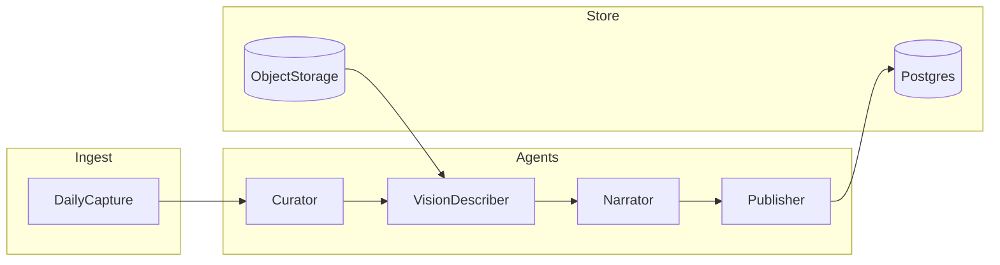

# Feature decomposition report — Smart tourism multi-agent system (Vietnam)

**Document version:** 1.0  
**Report date:** 2026-04-10  
**Related implementation plan:** Smart Tourism Multi-Agent System (Chunks 1–4 + Chunk R)  
**Method:** Work breakdown structure (WBS) epic → feature → user outcome → engineering problem → dependency → risk → priority. Install a dedicated decomposition skill later via agentskill if the course requires it.

---

## 0. Glossary

| Term | Definition |
|------|-------------|
| **Place / POI** | Point of interest: coffee, entertainment, sightseeing, or other venue shown on the map. |
| **Bubble** | Map marker whose **pixel radius** encodes combined weather, traffic, rating, and comment sentiment (deterministic formula shared by web and mobile). |
| **Capture** | User photo or selfie attached to a **calendar day** (Locket-inspired “today’s roll”), stored in object storage. |
| **Vlog post** | Autonomous narrative: title + emotional first-person Markdown generated overnight from that day’s captures via a **multi-agent** pipeline. |
| **Phase 1 (MVP)** | Narrow scope in §6; everything else is deferred with explicit YAGNI cuts. |

---

## 1. Executive summary

This report decomposes a **web + mobile** smart tourism product centered on a **Goong** map, **dynamic bubbles** driven by weather, traffic, ratings, and comment sentiment, a **daily capture** flow inspired by Locket, and **nightly autonomous vlog** generation using **multi-agent** workflows (vision + narrative + publish). The team has **six members**: two **AI core**, two **backend**, two **frontend** (web and mobile).

The work splits into three product pillars—**map intelligence**, **capture + generative diary**, and **accessibility**—plus cross-cutting **platform** (auth, storage, jobs). The highest-risk areas are **LLM safety and cost** for emotional copy, **real-time traffic fidelity** and API limits, **privacy** for user photos, and **inclusive design** verification. This document provides a **WBS**, **problem inventory**, **agent swimlane**, **accessibility mapping**, a **phased roadmap**, and a **leaf checklist** for tracking. Implementation detail lives in the separate engineering plan; this report is the **stakeholder-facing decomposition** for the next build phases.

---

## 2. Epic decomposition (WBS level 1–3)

| Epic ID | Epic | Feature (L2) | Feature ID | User outcome | Primary owner |
|---------|------|--------------|------------|--------------|---------------|
| E1 | Map & places | Goong-backed map | E1-F1 | See map centered on me and pan/zoom Vietnam tourism areas | FE |
| E1 | Map & places | POI discovery & list | E1-F2 | See nearby coffee, entertainment, sightseeing | BE + FE |
| E1 | Map & places | Bubble visualization | E1-F3 | Bubbles grow/shrink from conditions + rating + sentiment | FE + BE |
| E1 | Map & places | Category filter | E1-F4 | Toggle layers by category | FE |
| E2 | Intelligence | Weather signals | E2-F1 | Weather severity updates bubble factor | BE |
| E2 | Intelligence | Traffic signals | E2-F2 | Traffic severity updates bubble factor | BE |
| E2 | Intelligence | Comment sentiment | E2-F3 | New comments feed aggregate sentiment on place | BE + AI |
| E3 | Social / UGC | Ratings | E3-F1 | Rate a place; rating affects bubble | BE + FE |
| E3 | Social / UGC | Comments | E3-F2 | Comment on place; sentiment aggregated | BE + FE |
| E4 | Capture | Daily capture roll | E4-F1 | Quickly add photos/selfies to “today” | FE (mobile primary) |
| E4 | Capture | Upload & storage | E4-F2 | Media stored securely with presigned or server upload | BE |
| E5 | Vlog | Nightly job | E5-F1 | Wake up to a generated post for yesterday/today boundary | AI + BE |
| E5 | Vlog | Vision + narrative agents | E5-F2 | Coherent emotional story from multiple images | AI |
| E5 | Vlog | Safety & tone | E5-F3 | No harmful content; minimal PII leakage in text | AI + BE |
| E6 | Platform | Auth & identity | E6-F1 | My captures and posts belong to my account | BE + FE |
| E6 | Platform | Job observability | E6-F2 | Failed vlog jobs visible for support/debug | BE |
| E7 | Accessibility | Perceivable | E7-F1 | Color is not the only cue; scalable text | FE |
| E7 | Accessibility | Operable | E7-F2 | Large targets; keyboard/screen reader baseline (web) | FE |
| E7 | Accessibility | Understandable | E7-F3 | Plain language / cognitive-friendly mode | FE |
| E8 | Ops & release | CI & env | E8-F1 | Reproducible dev/staging | BE + FE |

---

## 3. Cross-cutting problems to solve later

| Problem ID | Description | Why it is hard | Candidate approach | Open decision | Priority |
|------------|-------------|----------------|--------------------|---------------|----------|
| P-API-01 | **Goong** quota, cost, and ToS for geocoding, maps, and any traffic-related APIs | Commercial limits; key exposure risk | Server-side proxy only; cache responses; batch geocode | Which Goong products exactly (JS SDK vs REST)? | P0 |
| P-DATA-01 | **Real-time traffic** accuracy | Ground truth expensive; APIs vary | Start with duration-based proxy or stub; document refresh cadence | Single provider vs hybrid? | P1 |
| P-PRIV-01 | **Photo privacy** and retention | Sensitive biometric-adjacent data; deletion requests | Encryption at rest; TTL policy; user delete day roll | Legal/policy minimum retention? | P0 |
| P-AI-01 | **LLM cost + latency** for vision + long narrative | Many images × token cost | Curator limits N images; batch vision; smaller model for MVP | Which provider/model? | P0 |
| P-AI-02 | **Safety / emotional tone** for “diary” copy | Over-sharing, sadness triggers, hallucinated facts | System prompts + classifier; optional human review queue | Automated only vs mod queue in v1? | P0 |
| P-AI-03 | **Agent evaluation** | Subjective quality | Golden-set images + rubric; regression on prompts | Metric: user rating on post or offline only? | P1 |
| P-MOB-01 | **Offline capture queue** | Upload failures on poor networks | Local queue + retry; idempotent day keys | Offline-first scope in Phase 1? | P2 |
| P-REL-01 | **Store release** (iOS/Android) | Signing, permissions, privacy strings | Expo EAS pipeline; camera/mic usage descriptions | Single bundle vs flavored? | P1 |

---

## 4. Multi-agent decomposition

### 4.1 Swimlane (responsibilities)

| Step | Agent / module | Inputs | Outputs | Failure mode | Mitigation |
|------|----------------|--------|---------|--------------|------------|
| S1 | **Curator** | List of asset URLs for `user_id` + `date`, cheap image metadata | Subset of URLs (≤ N), ordered | Too few usable images | Fall back to “short day” template post |
| S2 | **Vision describer** | Each selected image (URL or bytes via signed GET) | Per-image: caption, mood tags | API timeout, NSFW false positive | Retry; skip image; log |
| S3 | **Narrator** | Captions + mood tags + optional user locale | Markdown body, title, summary | Hallucination, unsafe text | Guardrails + block/regenerate |
| S4 | **Publisher** | Final text + metadata | `VlogPost` row; `DailyCapture.status = compiled` | DB deadlock | Idempotent publish by (user, date) |

### 4.2 Data contracts (conceptual)

- **Capture ingest:** `POST /captures` with `day` (date), `content_type`, optional `client_capture_id` for idempotency.
- **Job trigger:** Scheduler enqueues `run_vlog_job(user_id, date)` after local midnight or fixed UTC window for MVP.
- **Post read model:** `GET /posts` returns title, body, created_at, thumbnail_url.

### 4.3 Mermaid: vlog pipeline

### 4.4 Human-in-the-loop (optional)

- **Phase 1 default:** Fully automated publish with logging.
- **Phase 2 option:** User taps “Regenerate” or “Edit before publish” if product requires it (explicit scope add).

---

## 5. Accessibility decomposition

| Scenario | Requirement (concrete) | UI / API hook | Test method |
|----------|------------------------|---------------|-------------|
| **Color vision deficiency** | Bubbles use **pattern/stroke** or icon in addition to hue | Bubble style variants; theme tokens | Visual review + simulated deuteranopia; user test |
| **Low vision** | Scalable type; sufficient contrast on map chrome | CSS rem + contrast tokens; high-contrast theme | axe contrast; manual zoom |
| **Motor (coarse pointer)** | Min touch target **44×44** pt (mobile); forgiving hit slop | Design tokens on buttons | Ruler / platform inspector |
| **Screen reader (web)** | Map regions and POI list have **names and roles** | `aria-label`, list semantics | VoiceOver / NVDA smoke |
| **Screen reader (mobile)** | `accessibilityLabel`, `accessibilityRole` on capture + feed | React Native a11y props | TalkBack / VoiceOver |
| **Cognitive / plain language** | **Simple mode**: shorter sentences, fewer simultaneous controls | Copy tables `vi` + `simple`; reduced chrome | Reviewer checklist |
| **Motion sensitivity** | Respect `prefers-reduced-motion`; optional disable bubble pulse | CSS media query | Toggle simulation in devtools |
| **Photosensitive** | Avoid rapid full-screen flash on capture (if any flash UI) | Static transitions | Manual |

---

## 6. Phased roadmap

| Phase | Scope | Includes feature IDs | Explicit non-goals |
|-------|--------|----------------------|---------------------|
| **Phase 0** | Analysis & alignment | This report only | No production code requirement |
| **Phase 1 MVP** | Map + bubbles + static/semi-static metrics + capture upload + one vlog pipeline + basic a11y | E1-F1–F4, E2-F1–F3 (stub traffic OK), E3-F1–F2 minimal, E4-F1–F2, E5-F1–F3, E6-F1, E7-F1–F3 baseline, E8-F1 minimal | Social graph, offline-first, multiple LLM providers, mod queue |
| **Phase 2** | Reliability & cost | P-MOB-01 partial, P-API-01 hardening, P-AI-03 eval harness, E6-F2 | — |
| **Phase 3** | Scale & research | Better traffic fusion, personalized bubble weights, advanced cognitive aids | — |

### 6.1 YAGNI cut list (not in Phase 1)

- Friend graph / Locket-style real-time friend widgets (only daily roll + post).
- Multi-language emotional poetry beyond `vi` + optional `en` stub.
- On-device ML for blur/scene unless time permits.
- Full moderation marketplace or third-party CSAM pipeline beyond standard cloud checks.

---

## 7. Appendix: full feature checklist (leaf tasks)

Trace IDs to §2. Checkboxes for team tracking.

### E1 — Map & places

- [ ] E1-F1: Integrate Goong map on web (Next.js).
- [ ] E1-F1: Integrate Goong map on mobile (Expo).
- [ ] E1-F2: Backend `GET /places?bbox=` with seeded or synced POIs.
- [ ] E1-F2: Client fetch and render POIs on map.
- [ ] E1-F3: Implement shared `bubbleRadiusPx` (packages/types) + tests.
- [ ] E1-F3: Render circle markers sized from API normalized metrics.
- [ ] E1-F4: Category filter UI (coffee / entertainment / sightseeing).

### E2 — Intelligence

- [ ] E2-F1: Weather provider adapter + `weather_severity` on place or join table.
- [ ] E2-F2: Traffic severity source (stub or Goong-related) + refresh job.
- [ ] E2-F3: Comments → aggregate `comment_sentiment` (rule-based v1).

### E3 — Social / UGC

- [ ] E3-F1: POST rating; include in place DTO.
- [ ] E3-F2: POST comment; triggers sentiment update.

### E4 — Capture

- [ ] E4-F1: Mobile capture UI (camera + library).
- [ ] E4-F2: Presigned upload flow + `DailyCapture` persistence.

### E5 — Vlog

- [ ] E5-F1: Scheduler + worker job `run_vlog_job`.
- [ ] E5-F2: Curator + Vision + Narrator + Publisher graph (mocked tests).
- [ ] E5-F3: Safety prompts + basic block on policy violations.

### E6 — Platform

- [ ] E6-F1: Auth MVP (JWT or session); user-scoped captures and posts.
- [ ] E6-F2: Job status / logs endpoint or admin-only view (Phase 2 if tight).

### E7 — Accessibility

- [ ] E7-F1: Color-blind-safe bubble encodings + contrast audit.
- [ ] E7-F2: Large targets; web landmarks; mobile labels/roles.
- [ ] E7-F3: Simple / plain-language mode for key flows.

### E8 — Ops

- [ ] E8-F1: docker-compose local stack; documented env vars.

---

## Sign-off

| Role | Name | Date | Notes |
|------|------|------|-------|
| Team lead | _Pending_ | | Fill on freeze |

---

_End of report v1._
